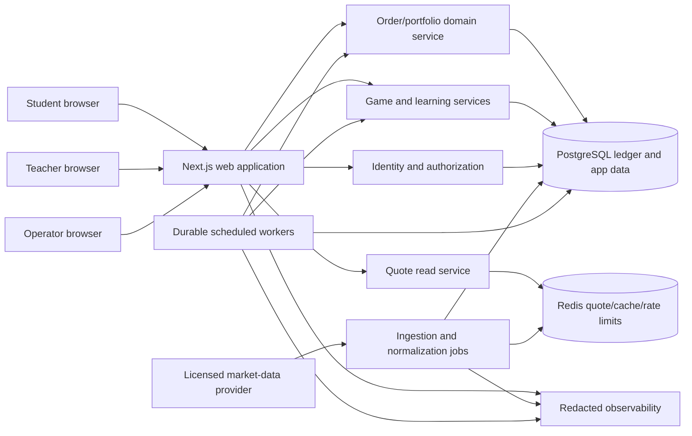
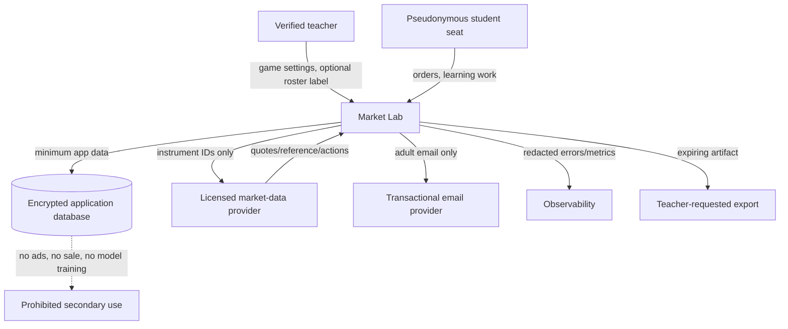

# Market Lab

## Comprehensive Product Requirements and Implementation Specification

- **Working title:** Market Lab
- **Production URL:** `https://stocks.mikesego.com`
- **Document status:** Approved for implementation with August 5 clarifications
- **Version:** 1.1-approved
- **Prepared:** August 5, 2026
- **Primary audience:** Product owner, designer, curriculum author, implementation LLM/engineering agent, QA, privacy/security reviewer
- **Source draft:** “Stock Market Game for Education — Comprehensive PRD” supplied by Mike Sego

> Market Lab is a simulation. It never accepts deposits, connects student brokerage accounts, recommends real investments, or places real orders.

**Quick navigation:** [Purpose and scope](#1-executive-summary) · [Users and learning](#5-users-roles-and-jobs-to-be-done) · [Student experience](#10-student-experience-specification) · [Teacher experience](#11-teacher-experience-specification) · [Trading rules](#14-market-clock-and-data-semantics) · [Requirements](#22-functional-requirements-catalog) · [Architecture](#23-system-architecture) · [Data/security/privacy](#24-data-model) · [Testing and launch](#33-test-and-verification-strategy) · [Approval decisions](#40-owner-approval-decisions)

---

## 0. How to use this specification

This is the normative product and engineering contract for version 1.0. An implementation is not complete merely because screens exist. It is complete only when the required behaviors, rule semantics, safety controls, tests, production deployment, and acceptance criteria in this document are satisfied.

Requirement language:

- **MUST / MUST NOT** means required for version 1.0.
- **SHOULD / SHOULD NOT** means expected unless an implementation constraint is documented.
- **MAY** means optional or configurable.
- “Launch” means verified production operation at `stocks.mikesego.com`, not a local preview.
- “Student” includes an individual student and a member of a shared team portfolio.
- “Teacher” includes a teacher, club leader, homeschool educator, or other authorized classroom facilitator.
- “Game” means one configured competition or learning season; a teacher may run several games.

Implementation priority when requirements conflict:

1. Child safety, privacy, security, and data-license obligations.
2. Financial correctness, auditability, and fair competition.
3. Teacher control and recoverability.
4. Accessibility and student comprehension.
5. Engagement and visual polish.
6. Convenience and implementation speed.

Implementation is authorized under the approved decisions in Section 40. That authorization does not include purchasing a market-data plan, adding another third-party service with material cost, collecting additional student data without explicit approval.

---

## Classroom offline execution update (September 2026)

The current classroom use case supersedes online-only order timing for assigned tablets. At `/classroom`, buys and sells complete immediately at the latest downloaded last-trade price, even offline, after hours, or on weekends. Reconnecting backs up original-price receipts and refreshes prices for future trades. One browser is assigned per student portfolio; teacher check-ins expose backup status. Full details: `docs/CLASSROOM_OFFLINE.md`.

## 1. Executive summary

Market Lab is a polished, classroom-first stock market simulation for grades 4–8. Students or teams receive $100,000 in virtual cash, research real U.S. companies and ETFs, submit simulated orders during authentic U.S. market sessions, and learn from what happens. Teachers can launch a class in minutes, control the investment universe and complexity, monitor both portfolios and learning, run structured missions, and assess students without needing to be investing experts.

The core loop is:

1. **Observe:** See the market, a company, and the current portfolio clearly.
2. **Think:** State a goal, prediction, evidence, and risk in a short decision card.
3. **Act:** Submit a market or limit order with transparent price and timing rules.
4. **Watch:** Follow the position, portfolio, benchmark, and relevant events.
5. **Explain:** Reflect on the result and distinguish a good decision from a lucky outcome.

The experience should feel like a modern science museum crossed with a high-quality financial terminal: energetic, tactile, and prestigious, but never juvenile, casino-like, or broker-promotional. It uses progressive disclosure rather than removing real vocabulary. A fourth grader can complete the same core action as an eighth grader, while the older student can reveal order-book concepts, fundamentals, benchmark-relative return, risk, and corporate actions.

Version 1.0 includes individual and team portfolios, two grade-band presets, real market calendars, market and limit orders, fractional shares, cash dividends, splits, a journal, missions and assessments, multiple fair leaderboards, detailed teacher controls, exports, student-safe authentication, platform administration, and production operations.

### 1.1 The central product decision

The official competition is intentionally simple: the portfolio with the greatest ending equity wins. Because every participant in a game begins with the same virtual cash, ranking by final portfolio value, profit, or total return produces the same order. The leaderboard shows ending equity and percentage return; total return includes cash, current holdings, dividends/distributions, and configured simulation fees.

Learning mastery, research, decision quality, reflection, diversification, and other educational evidence are assessed and celebrated separately. They appear in teacher reports, student final reports, badges, and optional named awards, but they never alter the financial leaderboard or cause a portfolio with less money to defeat one with more money.

### 1.2 The central technical decision

Market Lab uses a server-only asynchronous `MarketDataProvider` backed by Alpaca Basic’s IEX feed. Classroom mode executes immediately at the last downloaded price, online or offline. The application never uses Robinhood MCP or sends brokerage orders.

### 1.3 Launch definition

Version 1.0 is launched only when:

- A teacher can create a complete game, print or share student credentials, and run it without operator help.
- A student can join, learn, research, trade, reflect, and finish a season on a school Chromebook or tablet.
- Quotes, orders, holdings, cash, corporate actions, rankings, and exports reconcile exactly.
- No student email address, date of birth, phone number, home address, or brokerage information is requested.
- Accessibility, privacy, security, load, failure-recovery, and browser acceptance suites pass.
- The site is deployed to Vercel, `stocks.mikesego.com` points to it through Cloudflare DNS, and production smoke tests pass.
- The source is committed and pushed to the public `mikesego/market-lab` GitHub repository with deployment and operating documentation; secrets are never committed.

Classroom use is supported. See `docs/CLASSROOM_OFFLINE.md` for tablet setup, immediate saved-price execution, and automatic synchronization.

---

## 2. Product vision, positioning, and principles

### 2.1 Vision

Give every student the feeling of making consequential decisions in the real economy while teaching them that good investing is patient, evidence-based, diversified, and connected to real goals.

### 2.2 Positioning

For upper-elementary and middle-school educators who want financial learning to feel real, Market Lab is a classroom market simulation that combines authentic market behavior with structured decision-making and teacher-visible learning. Unlike portfolio games centered almost entirely on ending balance, Market Lab makes the thinking process legible and rewards durable financial judgment as well as performance.

### 2.3 Product principles

1. **Authentic, not performatively complex.** Use real terms and real rules where they affect student decisions. Explain complexity at the moment it matters.
2. **Decisions over outcomes.** A sound thesis can lose money; a reckless bet can win. The product must help students tell the difference.
3. **Progressive depth.** Never make the product look “for little kids.” Let younger learners operate a clear surface while advanced detail remains one tap away.
4. **Teacher calm is a feature.** Every classroom action needs a preview, undo path where financially possible, audit trail, and clear status.
5. **Fair by construction.** Everyone in one game uses the same data mode, calendar, valuation time, rules, and leaderboard cutoff.
6. **Privacy by default.** Student identity is pseudonymous; data is minimized; no advertising, behavioral tracking, sale of data, or training on student content.
7. **Celebrate learning, not gambling.** Reward research, reflection, patience, and recovery. Do not use slot-machine effects, “to the moon” language, loot boxes, or confetti tied to profit.
8. **Transparent simulation.** Every fill shows the source quote, quote time, rule, and calculation. The product never implies that a simulated fill is a real execution.
9. **Graceful failure.** Stale or unavailable data pauses fills; it never silently invents a price.
10. **Portable classroom evidence.** Teachers can export understandable records and students can leave with a final investment memo, not only a score.

### 2.4 Brand and tone

“Market Lab” is a working title and should be treated as replaceable until naming and trademark review. The brand voice is curious, direct, encouraging, and precise. It may be witty, but it must not mock losses or imply guaranteed returns.

Preferred vocabulary:

- “Test an idea,” “build a plan,” “investigate,” “virtual portfolio,” “market session,” “evidence,” and “trade-off.”
- “Up $420 today” plus “+0.42%,” not euphemisms that hide the math.
- “This order is waiting for the market to open,” not “Oops!”
- “Your portfolio is concentrated: 61% is in one company,” not “Bad portfolio.”

Prohibited vocabulary and patterns:

- “Guaranteed,” “easy money,” “risk-free stock,” “winning pick,” “hot tip,” or personalized real-world investment advice.
- Casino, betting, rocket, moon, jackpot, or FOMO metaphors.
- Shame, public callouts, or celebratory effects based solely on short-term gains.
- Implying Market Lab, its content, or an AI-generated explanation is a fiduciary or financial adviser.

---

## 3. Problem, opportunity, and benchmark

### 3.1 Problem

Existing classroom simulations prove that real-market play can motivate students, but typical products create five gaps:

- The interface and account model often feel inherited rather than designed for today’s Chromebooks and touch devices.
- A single ending-balance ranking rewards concentration, volatility, and luck over learning.
- Teachers see trades and balances but not necessarily what students believed or learned.
- Login is either too adult (individual email/password) or too weak (one shared class credential).
- “Realistic” is underspecified: stale quotes, closed-market orders, corporate actions, and resets can produce confusing or unfair results.

### 3.2 Opportunity

A focused product can make the simulation itself an assessment engine. Every meaningful action can produce evidence of math, financial reasoning, writing, risk awareness, and reflection without turning the game into worksheets.

The benchmark Stock Market Game serves grades 4–12, provides a $100,000 virtual portfolio, supports team play, and connects the simulation to teacher lessons and multiple academic subjects. Those validated patterns remain useful. Market Lab differentiates through individual-or-team flexibility, modern student identity, transparent execution, age presets, a richer decision journal, separate learning assessment, accessible charts, and a stronger operator specification.

### 3.3 Desired emotional arc

- **First 5 minutes:** “I’m trusted with something real.”
- **First trade:** “I understand exactly what I asked the system to do.”
- **First market move:** “I want to know why that happened.”
- **First loss:** “A loss is information, not failure.”
- **Mid-season:** “My plan is becoming more intentional.”
- **Final week:** “I can explain my decisions with evidence.”

---

## 4. Goals, non-goals, and success criteria

### 4.1 Product goals

- Let a new teacher create and start a playable class in under 10 minutes.
- Let students enter without personal email and complete a guided first trade in under 8 minutes.
- Accurately simulate the material mechanics of long-only U.S. stock and ETF investing during regular market sessions.
- Support both grades 4–5 and 6–8 without separate products or visibly childish/adult skins.
- Turn trades into evidence of research, prediction, risk thinking, and reflection.
- Make classroom competition safe, configurable, fair, and pedagogically useful.
- Provide teachers with real-time operational status and useful assessment summaries.
- Operate reliably for whole-class bursts on managed Chromebooks, tablets, and desktops.
- Minimize student data and meet the product controls needed for a COPPA/FERPA-oriented school deployment, subject to legal review.

### 4.2 Learning goals

By the end of a default six-week season, a participating student should be able to:

1. Explain the difference between saving and investing.
2. Explain what a stock represents and what an ETF does.
3. Read a stock quote, distinguish dollars from percent change, and calculate approximate position value.
4. Explain why market price can differ from a recently displayed price.
5. Distinguish market and limit orders.
6. Describe risk, return, time horizon, diversification, concentration, and opportunity cost.
7. Compare portfolio return with a benchmark rather than looking only at dollars gained.
8. Explain a dividend and stock split without treating either as free wealth.
9. Support an investment decision with evidence and identify a fact that could change the decision.
10. Reflect on process separately from outcome.

### 4.3 Business and adoption goals

- Establish a reusable, owner-operated classroom product at `stocks.mikesego.com`.
- Make the pilot credible enough that an educator can invite another educator without a live demo from the owner.
- Retain a complete and extensible technical foundation for future district SSO, standards reporting, historical scenarios, and additional asset classes.
- Avoid a business model that depends on student advertising, profiling, lead generation, or brokerage referrals.

### 4.4 Non-goals for version 1.0

- Real-money trading, deposits, withdrawals, securities custody, brokerage linking, or order routing.
- Personalized recommendations about what a student or family should buy with real money.
- Options, futures, forex, crypto, margin, leverage, short selling, securities lending, or day-trading instruction.
- Full replication of exchange microstructure, order routing, market depth, tax accounting, wash sales, Regulation SHO, pattern-day-trader rules, or broker-specific policies.
- Public/global student discovery, public profiles, direct messages, student-to-student chat, user-generated images, or social feeds.
- Advertising, sponsorship targeted to children, affiliate links, sale of student data, or third-party behavioral analytics.
- Native iOS/Android apps; version 1.0 is a responsive progressive web application.
- Full SIS/LMS sync, Google Classroom rostering, Clever, ClassLink, or district procurement automation.
- Bonds, mutual funds, foreign-listed securities, OTC securities, preferred shares, rights, warrants, units, closed-end funds, or leveraged/inverse products.
- Automated AI financial advice or unreviewed AI-generated news.

### 4.5 Version 1.0 outcome metrics

Initial targets, measured only with privacy-safe first-party events:

- Teacher median time from account creation to printable login cards: ≤10 minutes.
- Student successful first-session login: ≥97% without teacher credential reset.
- Student onboarding-to-first-valid-order completion: ≥85%.
- Weekly active students in an active game: ≥75%.
- Students completing at least four decision/reflection cycles: ≥70%.
- Median improvement from pre-assessment to post-assessment: ≥15 percentage points in pilots with both assessments enabled.
- Teachers who can correctly identify one student misconception from the dashboard: ≥80% in usability testing.
- Order accounting reconciliation errors: zero.
- Cross-portfolio or cross-game authorization incidents: zero.
- Quote/order status available during regular market hours: ≥99.9% monthly, excluding announced provider outages.
- p75 student page LCP on a representative school Chromebook/network: <2.5 seconds.
- p95 mutation acknowledgement, excluding market fill: <1 second.

Metrics are diagnostics, not engagement quotas. The system must not manipulate children to increase session time.

---

## 5. Users, roles, and jobs to be done

### 5.1 Primary personas

#### Student Explorer — grades 4–5

- Understands whole-number and decimal money operations; percent reasoning may be emerging.
- Recognizes consumer brands but may not understand the company/security distinction.
- Needs concrete language, short flows, visible units, and immediate causal feedback.
- Uses a shared or managed device and may have limited typing fluency.
- Wants agency, collection/progress, teamwork, and a story worth sharing.

Core job: “Help me make a real-feeling choice I understand, then show me what it teaches me.”

#### Student Strategist — grades 6–8

- Can work with ratios, percentages, graphs, and multi-step explanations.
- Wants greater control and may reject anything that looks babyish.
- Is susceptible to social proof and risk-taking competition.
- Can learn order types, benchmarks, valuation, diversification, fundamentals, and trade-offs.

Core job: “Let me test my own market thesis and prove that my process is improving.”

#### Classroom teacher

- Has 25–35 students, a short class period, managed devices, and limited setup time.
- May have no investing background.
- Needs to know what is happening, what to teach next, and how to recover from mistakes.
- Must explain the tool to parents, administrators, and IT staff.

Core job: “Let me run a safe, rigorous, exciting market unit without becoming a broker, system administrator, or privacy lawyer.”

### 5.2 Secondary personas

#### Co-teacher / classroom aide

Can help manage students, review work, and view reports, but cannot delete the game owner or change organization-level legal settings.

#### Homeschool educator / club leader

Uses the same teacher path without claiming school authority. If students under 13 use the product outside a school-authorized context, parent/guardian consent requirements apply before personal information is collected. The launch flow must not pretend a club leader is automatically a school.

#### Platform operator

Maintains provider health, market calendars, privacy requests, incidents, feature flags, and customer support. Operator access is exceptional, audited, least-privilege, and never used for casual browsing of student work.

#### Parent or guardian

Does not require an account in version 1.0. Receives a plain-language product/privacy handout and can exercise access/deletion rights through the teacher or operator. A read-only parent portal is post-1.0.

### 5.3 Role and permission summary

| Capability | Student | Team member | Teacher | Co-teacher | Platform operator |
|---|---:|---:|---:|---:|---:|
| View own/team portfolio | Yes | Yes | Yes | Yes | Support-only |
| Place order | Yes | Configurable | No impersonation | No impersonation | Never |
| Write decision/reflection | Yes | Yes | Review | Review | Support-only |
| View class leaderboard | If enabled | If enabled | Yes | Yes | No routine access |
| View other detailed portfolios | No | No | Yes | Yes | Support-only |
| Create/configure game | No | No | Yes | Limited | No |
| Reset/correct portfolio | No | No | Yes, controlled | If granted | Emergency tool |
| Export class data | No | No | Yes | If granted | Privacy/support only |
| Manage provider/calendar | No | No | No | No | Yes |
| View student roster labels | No | No | Yes | Yes | Redacted by default |
| Delete organization/game data | No | No | Owner | No | Executes verified request |

Every server action MUST authorize the actor, organization, game, and resource relationship independently of the client route.

---

## 6. Grade-band and participation modes

### 6.1 Explorer preset — grades 4–5

Default behavior:

- Market orders; limit orders introduced by a teacher mission and off by default.
- Dollar-based ordering is primary; fractional shares are on.
- Curated eligible universe of common household-name companies and broad, unleveraged ETFs.
- Simplified cash availability: sale proceeds are immediately reusable, clearly labeled as a classroom simplification.
- Quote anatomy shows price, dollar change, percent change, and timestamp.
- Fundamentals surface company description, sector, market capitalization band, revenue trend, profitability status, and simple valuation context without unsupported grades.
- Short decision card: goal, reason, risk, and intended holding period.
- Visual portfolio map, concentration coach, and benchmark comparison.
- Vocabulary tooltips appear inline and remain accessible by keyboard.

### 6.2 Strategist preset — grades 6–8

Default behavior:

- Market and limit orders; day and good-til-canceled duration.
- Dollar or share quantity; fractional shares are on.
- Full version-1.0 eligible universe subject to liquidity, price, and product-type filters.
- Optional T+1 settled-cash mode; default remains simplified settlement unless the teacher enables the “cash-account rules” mission.
- Bid, ask, spread, volume, market cap, P/E where meaningful, earnings date, 52-week range, sector, and benchmark-relative charts.
- Structured thesis: evidence, expected mechanism, time horizon, principal risk, and invalidation condition.
- Scenario and allocation tools.

### 6.3 Visual parity

Both presets use the same design system, navigation, brand, and core vocabulary. Explorer mode changes density, scaffolding, and default exposure—not quality or seriousness. A student can reveal “More detail” on any instrument regardless of preset. A teacher may override individual feature toggles.

### 6.4 Portfolio participation modes

#### Individual

Each seat owns a portfolio and submits its own orders and work. This is the default for classes where devices and time permit.

#### Team

Two to five students share one portfolio. Each member has a unique login and attribution. Suggested rotating roles are Researcher, Risk Checker, Trader, and Reporter. The teacher can configure:

- Any member may submit an order.
- A member proposes and a second member approves.
- Only the currently assigned Trader may submit.
- Teacher approval required above an order-value or concentration threshold.

Decision cards, proposals, approvals, orders, and reflections retain member attribution. Credentials are never shared even when the portfolio is shared.

### 6.5 Spectator/demo mode

A teacher can open a seeded, read-only demonstration with synthetic student records. Real classes use their own teacher-managed seasons and student credentials.

---

## 7. Pedagogical model

### 7.1 Learning framework

Market Lab organizes learning around a repeated **Observe → Think → Act → Watch → Explain** cycle. The application must capture the cycle as structured data so a teacher can evaluate growth over time.

Each cycle may include:

- A market observation or teacher prompt.
- A decision card written before an order.
- The order and its execution evidence.
- A scheduled reflection after a market interval or event.
- A misconception check and optional revision.

### 7.2 Core misconception protections

The product must explicitly address these common misconceptions:

- A lower share price does not necessarily make a company cheaper.
- A familiar or beloved product does not automatically make its stock a good investment.
- Dollar gain cannot be compared fairly without starting value or percentage return.
- A stock split changes pieces, not the total pie at the split instant.
- A dividend is a transfer of company value, not free money.
- Diversification reduces company-specific risk but cannot eliminate market losses.
- A market order prioritizes execution, not a guaranteed price.
- A limit order controls price but may never fill.
- One successful trade does not prove a repeatable skill.
- A well-reasoned decision can have a poor short-term outcome.
- Cash is a deliberate allocation with opportunity cost, not “doing nothing.”
- The game’s short season is not a model of a lifetime investing horizon.

### 7.3 Standards alignment

The curriculum map MUST cite and align to the 2021 National Standards for Personal Financial Education, especially grade-4 and grade-8 outcomes for saving, investing, managing risk, and decision consequences. It SHOULD cross-reference relevant Common Core math and ELA practices, including decimal operations, ratios, percentages, proportional reasoning, reading informational text, evidence-based writing, and data interpretation.

The app must label alignments as “supports” rather than claiming formal certification. State-specific alignment is post-1.0.

### 7.4 Assessment model

- Optional 10–12 item pre-assessment before first independent trade.
- Embedded checks in missions; immediate explanatory feedback.
- Post-assessment using concept-equivalent but not identical items.
- Decision rubric scored automatically for completeness and optionally by the teacher for evidence quality.
- Student final memo using portfolio evidence.
- Teacher dashboard by concept: not started, developing, demonstrated, needs review.

Assessment items MUST NOT expose a permanent public grade. Students see feedback and progress; teachers control whether a percentage is shown.

### 7.5 Default six-week curriculum arc

| Week | Mission | Concepts | Required evidence |
|---|---|---|---|
| 0 | Market orientation | Simulation vs. real money, company, stock, ETF, quote | Guided practice order in a sandbox |
| 1 | Build a plan | Goals, time horizon, saving vs. investing, opportunity cost | Portfolio plan and first decision card |
| 2 | Company detective | Products vs. companies, ticker research, evidence | Company brief and sourced claim |
| 3 | Don’t bet the lab | Diversification, concentration, sectors, ETF | Allocation comparison and rebalance proposal |
| 4 | Orders have instructions | Market/limit orders, bid/ask/spread, market hours | One justified order-type choice |
| 5 | Markets react | News, earnings, expectations, price change | Before/after hypothesis reflection |
| 6 | Judge the process | Benchmark, return, drawdown, luck vs. skill | Final investment memo and post-assessment |

Optional extension missions cover dividends, splits, compounding with a historical scenario, cash settlement, inflation, fees, and ethics.

### 7.6 Teacher lesson package

Every default mission includes:

- 30-second overview.
- Learning objectives and standards support.
- Teacher background with plain-language answers.
- 5-, 15-, and 45-minute implementation variants.
- Projector-ready launch slide.
- Student directions.
- Anticipated misconceptions.
- Discussion prompts.
- Accommodation and extension suggestions.
- Exit ticket.
- Answer/rubric guidance.
- What data appears in the teacher dashboard afterward.

---

## 8. Scope and release structure

All phases below are part of the committed version-1.0 build after approval. “Later phase” does not mean optional; it defines dependency order.

### Phase 0 — Foundation and provider-interface gate

- Finalize the working name, threat model, data map, provider interface, future contract requirements, architecture decision records, design tokens, and game-rule fixtures.
- Create the public GitHub repository, CI, environments, Vercel project, database, cache, secrets, and operator runbooks; keep all credentials outside source control.
- Build the Alpaca Basic IEX provider, provider-response contract fixtures, and deterministic financial calculations without adding a runtime synthetic-price mode.

Exit: engine and Alpaca normalization tests pass; live-data failures stop fills safely; no student-facing production traffic.

### Phase 1 — Playable vertical slice

- Teacher authentication, organization, game wizard, student seats/login cards.
- Student onboarding, dashboard, instrument search/detail, decision card, market order, order status, portfolio ledger.
- Regular-session calendar, quote adapter, delayed/real-time labeling, basic teacher roster and order feed.

Exit: one invited pilot class can complete a guided trading session with exact reconciliation.

### Phase 2 — Complete classroom and learning experience

- Individual/team modes, missions, assessments, journal/reflections, teacher lesson center, feedback, announcements, exports, login recovery.
- Explorer and Strategist presets, responsive/accessibility pass, student progress and concept views.

Exit: default six-week season is runnable without operator assistance.

### Phase 3 — Market depth and fair competition

- Limit/GTC orders, fractional edge cases, dividends, splits, symbol changes, benchmark engine, historical charts, portfolio health, financial rankings, rank privacy, and final reports.
- Queue/retry/dead-letter operations and provider failover behavior.

Exit: market-event fixtures, reconciliation, fairness, and recovery suites pass.

### Phase 4 — Production hardening

- Privacy center, retention/deletion, audit viewer, CSP, abuse controls, backup/restore drill, load tests, cross-tenant security suite, WCAG 2.2 AA audit, incident tooling, support documentation.

Exit: launch checklist in Section 38 is signed off.

### Phase 5 — Production launch

- Production Vercel deployment.
- Cloudflare DNS for `stocks.mikesego.com` pointing to Vercel while DNS remains managed by Cloudflare.
- Production database migrations, seed templates, provider keys, monitors, smoke tests, and rollback verification.
- Push tagged source to the public GitHub repository and record deployment SHA.

Exit: launch definition in Section 1.3 is met.

Classroom use is supported. See `docs/CLASSROOM_OFFLINE.md` for tablet setup, immediate saved-price execution, and automatic synchronization.

### Post-1.0 candidates

District SSO/rostering, LMS grade passback, parent portal, teacher marketplace, historical replay seasons, bonds and mutual funds, student-created screened universes, multilingual content, native apps, multi-school tournaments, and formal state-standards reports. These must not leak into version 1.0 unless separately approved.

---

## 9. Information architecture and routes

### 9.1 Public

- `/` — Product explanation for educators; no student data or live class leaderboard.
- `/how-it-works` — Simulation, learning model, market-data timing, and safety.
- `/educators` — Classroom setup and curriculum overview.
- `/privacy` — Child- and adult-readable privacy notice.
- `/terms` — Terms and simulation disclaimer.
- `/accessibility` — Accessibility statement and contact path.
- `/status` — Provider/system status without sensitive infrastructure detail.
- `/join` — Student class/seat entry.
- `/teacher/sign-in` — Teacher authentication.

### 9.2 Student application

- `/app` — Today dashboard.
- `/app/learn` — Mission path and knowledge checks.
- `/app/discover` — Teacher-curated lists, search, sectors, and ideas without recommendations.
- `/app/stocks/[symbol]` — Instrument detail.
- `/app/trade/[symbol]` — Order ticket and confirmation.
- `/app/orders` — Open, filled, canceled, rejected, and expired orders.
- `/app/portfolio` — Holdings, allocation, performance, cash, benchmark, and health.
- `/app/journal` — Decision cards, reflections, and final memo.
- `/app/season` — Progress, awards, and leaderboard if enabled.
- `/app/help` — Searchable glossary, simulation rules, and teacher contact.
- `/app/account` — Alias, accessibility preferences, current-session security, sign out.

### 9.3 Teacher application

- `/teacher` — Cross-game home and action queue.
- `/teacher/games/new` — Game creation wizard.
- `/teacher/games/[gameId]/overview` — Live class pulse.
- `/teacher/games/[gameId]/students` — Seats, credentials, status, and recovery.
- `/teacher/games/[gameId]/portfolios` — Portfolio comparison and drill-down.
- `/teacher/games/[gameId]/orders` — Order stream, flags, and audit evidence.
- `/teacher/games/[gameId]/learning` — Missions, concepts, rubrics, and feedback.
- `/teacher/games/[gameId]/leaderboards` — Financial ranking display, privacy, and separate award controls.
- `/teacher/games/[gameId]/announcements` — One-way classroom messages.
- `/teacher/games/[gameId]/settings` — Rules, dates, universe, co-teachers, retention.
- `/teacher/games/[gameId]/exports` — CSV/PDF generation and history.
- `/teacher/resources` — Lesson center and implementation guides.
- `/teacher/organization` — Organization profile, data terms, co-teachers, deletion.

### 9.4 Operator application

- `/ops` — System health and incident queue.
- `/ops/providers` — Quote status, lag, quota, and circuit breakers.
- `/ops/calendars` — Trading sessions and overrides.
- `/ops/corporate-actions` — Pending, applied, failed, and manual review.
- `/ops/support` — Time-bound, redacted support lookup.
- `/ops/privacy` — Verified export/deletion requests.
- `/ops/audit` — Privileged action log.

Operator routes MUST use separate authorization, mandatory MFA/passkey, and noindex headers. They are not linked from student or teacher navigation.

---

## 10. Student experience specification

### 10.1 First entry and credentials

The preferred student account is a teacher-generated **seat**, not an email identity.

Default credential package:

- Eight-character class code, excluding ambiguous characters.
- Unique seat alias such as “Cobalt Otter 14,” generated from a reviewed word list.
- Unique four-word recovery phrase or high-entropy QR login token.
- Optional teacher-only roster mapping printed or stored separately.

Join flow:

1. Student opens `/join`, scans a QR code or enters the class code.
2. Student chooses their assigned alias or enters the short seat code from the card.
3. Student enters the recovery phrase if the QR token did not authenticate the seat.
4. Server verifies that the game accepts joins, the seat is active, and attempts are within rate limits.
5. Student sees game name, teacher display name, alias, and a clear “This is a simulation—no real money” statement.
6. Student selects shared-device or trusted-device session behavior. Shared device is the default.
7. First-time users enter the orientation mission; returning users enter Today.

Requirements:

- Class code alone MUST NOT authenticate a student.
- Credentials MUST NOT contain a student’s real name.
- QR URLs MUST contain a single-use exchange token, not a reusable raw credential.
- A teacher can revoke/reissue one seat without affecting its portfolio or journal.
- Student sessions expire after 8 hours or 30 minutes of inactivity on shared devices; teachers may set 1–12 hours.
- Sign-out is always visible. On shared-device sign-out, local application caches are cleared.
- Login errors do not reveal whether a particular alias exists outside a validated class context.
- After repeated failure, the interface routes the student to “Ask your teacher for a new card,” while the teacher sees a recovery action.

### 10.2 Orientation mission

The orientation is interactive and skippable only by the teacher. It uses a separate practice ledger and synthetic, clearly labeled company so practice cannot change the competitive portfolio.

Steps:

1. Identify virtual cash and explain that $100,000 is a learning scale, not typical disposable household cash.
2. Read a quote and its timestamp.
3. Choose a small dollar amount to invest in the synthetic company.
4. Review estimated shares and what can change before execution.
5. Submit, see a simulated fill based on eligible live quote evidence, and inspect cash + holding = total equity.
6. Answer one causal check: “Did buying the stock immediately make the portfolio richer?” Correct answer: no, aside from spread/fee assumptions; cash changed form.
7. Return to the real game with a short readiness summary.

### 10.3 Today dashboard

The student home screen prioritizes six elements in this order:

1. Market status: open/closed/opens in/early close/data delayed/data unavailable, always in Eastern Time plus local-time tooltip.
2. Portfolio equity, available cash, today’s dollar and percent change, total return, and data timestamp.
3. Next learning action or teacher announcement.
4. Portfolio allocation and concentration insight.
5. Watchlist/teacher-curated market cards.
6. Season progress and leaderboard teaser if enabled.

Rules:

- Price and performance values always show an as-of time.
- Positive/negative state uses sign, arrow, words, and color—not color alone.
- A student may hide dollar balances on screen with a privacy toggle for classroom projection.
- When the market is closed, the dashboard explains when submitted orders can next run.
- When data is stale, the most prominent status is data freshness, not portfolio movement.
- The page must avoid a scrolling ticker or flashing price changes.

### 10.4 Discover and search

Discover is not a recommendation feed. It contains neutral, explainable entry points:

- Teacher watchlists.
- Broad sectors with plain descriptions.
- “Companies behind things you know,” labeled as exploration rather than picks.
- Broad-market and sector ETFs.
- Upcoming earnings and recent high-volume instruments only if the provider license covers the data and the card explains what the list means.
- A compare tray for up to four instruments.

Search requirements:

- Search by symbol or company name.
- Eligibility is computed server-side; ineligible results explain why they cannot be traded.
- Duplicate share classes are clearly labeled.
- Funds are labeled ETF; common stock is labeled Company stock.
- No OTC, leveraged/inverse, warrant, right, unit, preferred, or unsupported security appears as tradable.
- Teacher-restricted instruments remain viewable only if the teacher setting allows research of blocked assets.
- Search results show price and timestamp, never unlabeled “live.”

### 10.5 Instrument detail

Required modules:

- Company/fund name, symbol, instrument type, exchange, sector/category, tradability.
- Current eligible quote: last, bid, ask where licensed, dollar and percent change, as-of time, session status, data-delay badge.
- 1D, 1W, 1M, 3M, 1Y charts with an accessible data table and summary sentence.
- “What it is”: sourced company or ETF description and major product/strategy.
- “Numbers that matter”: market-cap band, revenue and earnings trend, P/E only when meaningful, dividend yield, 52-week range, average volume/liquidity band, next earnings date if licensed.
- “Think before you trade”: familiarity is not evidence, principal company/sector risks, concentration effect, and existing exposure.
- Student notes and prior decisions for the instrument.
- Buy or Sell action, depending on holdings and game state.

Data that is unavailable, stale, not meaningful, or not licensed must be omitted or marked unavailable; it must never be replaced with zero.

### 10.6 Decision card

Before the first purchase of a new instrument, a decision card is required unless the teacher disables it for a live demonstration. Repeat buys prompt reuse/revision. Sells prompt a shorter exit rationale.

Explorer fields:

- What goal does this choice support?
- Why might this company or fund grow or pay value over time?
- What is one risk?
- How long do you plan to hold: days, weeks, months, or years in real life?
- Evidence source: company facts, teacher resource, official filing, reputable news, or other.

Strategist fields:

- Thesis in one or two sentences.
- Evidence claim and source URL/title.
- Expected mechanism: how would the evidence affect business results or investor expectations?
- Time horizon.
- Principal risk.
- Invalidation condition: what observable fact would change the thesis?
- Intended portfolio weight after the order.

The system may suggest sentence starters and flag missing fields. It MUST NOT grade a thesis as financially correct or tell a student to buy/sell. Automated feedback is limited to structure, unsupported certainty, missing source, obvious unit confusion, and concentration facts.

### 10.7 Order ticket

The order ticket is a four-step progressive form:

1. **Action:** Buy or Sell.
2. **Amount:** Dollars or shares; show calculated estimate and “You own” for sells.
3. **Instructions:** Market or limit, duration if applicable.
4. **Review:** Estimated debit/credit, available cash/shares, projected allocation, market/data status, decision-card summary, and exact execution rule.

Submission requires a final action labeled “Submit simulated order.” Never label it merely “Trade” or “Buy now.”

Review copy examples:

- Open market: “This market order will use the next eligible quote. A buy normally fills at the ask, which can differ from the last price shown.”
- Closed market: “The market is closed. This order will wait for the next regular session and the opening price may be very different.”
- Delayed mode: “This game uses market data delayed about 15 minutes. Everyone in this game trades from the same delayed feed.”
- Limit buy: “This can fill only at $125.00 or lower. It may not fill.”
- Concentration: “If filled, 43% of your portfolio would be in this company. Your teacher allows it; consider the risk.”

### 10.8 Order receipt and lifecycle

Immediately after submission the student receives an immutable receipt containing:

- Order ID and creation time.
- Symbol, side, requested dollar/share quantity, order type, limit, duration.
- Market/data mode.
- Current state and plain-language next step.
- Decision card link.

The UI updates through server-sent events or safe polling. It never optimistically calls an order “filled.” Every transition is visible in order history.

### 10.9 Portfolio

Portfolio modules:

- Total equity, cash, holdings market value, total return, today’s change, benchmark return, and excess return.
- Equity chart with deposits/reset events excluded from investment return and visibly annotated.
- Allocation by holding and sector; table equivalent.
- Holdings table: symbol, quantity, average cost, current price/time, value, portfolio weight, unrealized gain/loss, total distributions.
- Portfolio health: concentration, diversification, turnover, cash-plan alignment, and data completeness.
- Available cash and settled cash when T+1 mode is enabled.
- Upcoming/processed corporate actions.
- Realized and unrealized performance with explainer.

Portfolio health is descriptive, not a recommendation or a moral grade. It says what the numbers show and links to the relevant mission.

### 10.10 Journal and reflection

Reflection prompts are created when any of the following occurs:

- 24 regular-session hours after a new position.
- Position moves ±5%, configurable.
- Student sells all or part of a position.
- Relevant earnings/corporate action occurs.
- Weekly teacher checkpoint.
- Season close.

Prompt structure:

- What happened?
- Which part of your original reasoning still holds?
- What surprised you?
- Was the process good, the result good, both, or neither? Explain.
- Hold, add, reduce, sell, or gather more evidence? This is a reflection answer and does not place an order.

Students can revise reflections until the teacher locks a checkpoint; revisions retain version history for the teacher.

### 10.11 Season and finish

At season close:

- New orders are disabled at the configured cutoff.
- Open day orders expire; open GTC orders cancel with `GAME_ENDED`.
- Final valuation uses the shared official game cutoff snapshot.
- Leaderboards freeze only after valuation and corporate-action jobs reconcile.
- Student receives a final report: return, benchmark comparison, allocation history, largest drawdown, decision/reflection evidence, mastery change, and awards.
- Student completes or exports a final memo.
- Teacher can keep the game read-only for the retention period.

---

## 11. Teacher experience specification

### 11.1 Teacher authentication and onboarding

Teachers authenticate through passkey, Google/Microsoft OAuth, or email magic link. Password-only teacher accounts are not offered. MFA/passkey is required for organization owners and any teacher who can export roster-linked data.

Onboarding collects only:

- Teacher name and verified email.
- Organization/classroom display name.
- Context: school-authorized, homeschool, afterschool/club, or personal demo.
- Country/state for legal/market-time guidance, not student profiling.
- Agreement to terms, privacy notice, acceptable use, and data-role statement.

School-authorized onboarding explains that the teacher must use the product consistently with school/district policy. Non-school contexts receive the parent-consent gate applicable to under-13 participants.

### 11.2 Game creation wizard

The wizard has five short steps and a final review:

1. **Class:** game name, grade band, timezone, individual/team, approximate seats.
2. **Schedule:** start, trading start, trading cutoff, end, days of week, freeze windows.
3. **Learning:** six-week template or custom missions, pre/post assessment, decision-card requirements.
4. **Market rules:** universe preset, order types, fractional shares, settlement mode, position warnings/caps, data mode determined by plan.
5. **Competition:** leaderboard visibility, alias/privacy settings, and separate educational awards. The financial ranking formula is fixed.
6. **Review:** human-readable rulebook and exact consequences.

Creation can be saved as a draft. Publishing generates seats and login cards. Material rule changes after the first fill require a warning, reason, and audit event; changes affecting fairness may apply only to a cloned game.

### 11.3 Game templates

Required templates:

- Explorer 4-week introduction.
- Explorer 6-week complete.
- Strategist 6-week complete.
- Strategist 10-week extended.
- One-day demonstration using synthetic practice quotes.

Teachers may duplicate a prior game without duplicating student credentials or work.

### 11.4 Seats, roster, and credential recovery

Teachers can:

- Generate 1–50 seats per game, with a soft warning above 40.
- Assign students to teams by drag-and-drop plus keyboard-accessible controls.
- Print one-per-page or card-grid login PDFs.
- Copy a join link and display a projector QR.
- See never-joined, active, locked, and recovery-needed seats.
- Reissue one credential, terminate sessions, deactivate/reactivate a seat, or transfer a seat between teams before the first team fill.
- Download an offline alias-to-student mapping sheet.

Optional roster labels:

- The recommended path is for teachers to keep the real-name mapping offline.
- If the teacher adds a private roster label, it is encrypted at the application layer, visible only to authorized teachers, excluded from URLs/logs/analytics, and deleted on the configured schedule.
- Public/student views always use the generated alias.

Teachers never see the existing recovery phrase after issuance; they reissue it.

### 11.5 Live class overview

The overview answers, at a glance:

- Is the market open and is the data healthy?
- Who cannot log in?
- Who has not completed today’s action?
- Which orders are waiting, rejected, or need explanation?
- Which portfolios have extreme concentration, unusually high turnover, or no investments?
- Which concepts are producing misconceptions?
- What is the recommended next teaching move?

The teacher can project a **Classroom Mode** that strips private labels, hides exact balances if configured, and shows selected discussion cards or anonymous leaderboard data.

### 11.6 Student/portfolio drill-down

For each seat/team, teachers see:

- Login/activity status, not invasive device telemetry.
- Portfolio, holdings, cash, open orders, transaction history, and audit evidence.
- Allocation and performance history.
- Decision cards and reflections with version history.
- Mission progress, assessment evidence, misconceptions, teacher feedback.
- Credential, team, accommodation, and reset controls.

Teachers cannot submit an order while impersonating a student. A teacher demonstration uses a separate demo portfolio. This preserves attribution and trust.

### 11.7 Teacher interventions

Supported actions:

- One-way announcement to game or team.
- Assign/unassign mission and set due date.
- Add private feedback or a rubric score.
- Pause new orders for one seat, team, or game.
- Cancel open orders, with a reason and audit trail.
- Correct a platform-caused ledger error through a compensating adjustment workflow.
- Reset a practice portfolio or, with explicit confirmation, a competitive portfolio.
- Reopen a completed reflection or assessment.
- Hide/reveal leaderboard and choose award views.

Reset workflow:

1. Show exactly what will change and what will remain.
2. Require typed game/alias confirmation for competitive resets.
3. Require a reason.
4. Create compensating ledger entries; never delete transactions.
5. Annotate charts and exports so returns are not misleading.
6. Notify the affected student in plain language.

### 11.8 Lesson center

Teachers can filter by grade band, duration, concept, standards support, before/during/after trading, whole class/small group, and printable/digital. Each resource uses the package in Section 7.6. Teachers can preview the exact student view.

### 11.9 Exports and reports

Required exports:

- Roster status CSV.
- Portfolio snapshot CSV.
- Holdings CSV.
- Order and fill audit CSV.
- Learning progress CSV.
- Decision/reflection CSV or JSON.
- Student final report PDF.
- Class summary PDF.
- Full game archive ZIP containing CSV/JSON plus a manifest and schema version.

Exports are generated asynchronously, encrypted at rest, available through expiring signed URLs, audited, and deleted after seven days. Roster labels are excluded by default and require an explicit checkbox and reauthentication.

### 11.10 Co-teachers

Game owner can invite a verified adult email and grant scoped roles:

- Instructor: full game management except deletion/ownership transfer.
- Reviewer: learning work and reports, no credentials or rules.
- Aide: roster/login recovery and read-only progress.

Invitations expire after seven days. Co-teacher removal terminates active sessions and is audited.

---

## 12. Game configuration and lifecycle

### 12.1 Required configuration

| Setting | Explorer default | Strategist default | Constraints |
|---|---|---|---|
| Starting cash | $100,000 | $100,000 | $1,000–$10,000,000 |
| Game length | 6 weeks | 6 weeks | 1 day–1 school year |
| Participation | Individual | Individual | Individual or 2–5/team |
| Eligible universe | Curated | Full eligible | Teacher allow/block lists |
| Fractional shares | On | On | 0.000001 share precision |
| Market orders | On | On | Regular session only |
| Limit orders | Off | On | Teacher toggle |
| GTC duration | Off | On | Max through game end |
| Closed-market queue | On | On | Or reject, teacher choice |
| Settlement | Simplified | Simplified | Optional T+1 settled cash |
| Commission | $0 | $0 | Optional flat simulation fee |
| Minimum order | $1 | $1 | Up to $1,000 |
| Max position | Warning at 25% | Warning at 25% | Optional hard cap 10–100% |
| Daily trade guardrail | Reflect after 5 | Reflect after 8 | Optional hard cap |
| Benchmark | Broad U.S. ETF proxy | Broad U.S. ETF proxy | One shared benchmark |
| Leaderboard | Final equity/return, aliases | Final equity/return, aliases | Visible/hidden; awards separate |

The game rulebook generated from settings is visible to students before their first competitive order and remains versioned.

### 12.2 Lifecycle states

`DRAFT → SCHEDULED → ONBOARDING → ACTIVE → TRADING_FROZEN → RECONCILING → COMPLETE → ARCHIVED`

- **DRAFT:** editable; no student access.
- **SCHEDULED:** credentials may be distributed; orientation only.
- **ONBOARDING:** practice mission and pre-assessment available; competitive trading not started.
- **ACTIVE:** eligible orders accepted according to session state.
- **TRADING_FROZEN:** learning/reflection remains open; no new orders.
- **RECONCILING:** final quote, fills, corporate actions, rankings, and reports processing; leaderboards marked provisional.
- **COMPLETE:** read-only results and final work.
- **ARCHIVED:** teacher access retained according to policy; student sessions revoked.

State transitions are scheduled jobs plus operator-safe manual overrides. A transition is idempotent and produces a domain event.

### 12.3 Freeze windows

Teachers may define recurring or one-time windows in game timezone, such as “No orders during a test.” Existing open limit orders either remain eligible or pause according to a clearly chosen setting. Default: existing orders remain eligible because that mirrors market instructions; teacher-created emergency freeze cancels/pause-marks them only after explicit confirmation.

### 12.4 Rule changes

Changes are classified:

- **Cosmetic/instructional:** title, announcements, mission dates; apply immediately.
- **Prospective:** trade cap, decision requirement, new allowlist item; apply to future actions and version rulebook.
- **Fairness-breaking:** starting cash, data mode, settlement basis, ranking cutoff/basis, or removing a previously eligible held instrument; prohibited after first fill except operator incident workflow or game clone. The core final-equity/return formula is not teacher-editable.

---

## 13. Tradable instrument universe

### 13.1 Version-1.0 eligible types

- U.S.-listed common stocks.
- U.S.-listed ADRs only if the provider reliably supplies reference/corporate-action data and teacher has not disabled them.
- U.S.-listed, unleveraged, non-inverse ETFs.

### 13.2 Default eligibility filters

An instrument is eligible only when all are true:

- Active listing on a supported U.S. exchange.
- Tradability/reference status is active.
- Security type is in Section 13.1.
- Latest eligible regular-session price is at least $5.00, configurable to $1.00–$20.00.
- 20-day median daily dollar volume is at least $5 million.
- Market capitalization is at least $300 million for companies, unless specifically teacher-allowed.
- Not under a known regulatory halt at execution.
- Not on the platform/operator blocklist.
- Corporate-action state is not unresolved.

Eligibility is re-evaluated daily. A held instrument that becomes ineligible remains visible and sellable when legally/technically possible but cannot be increased. Open buy orders cancel with a precise reason.

### 13.3 Excluded by default

- OTC and expert-market securities.
- Penny stocks below configured threshold.
- Leveraged and inverse ETFs/ETNs.
- Volatility-linked, single-stock leveraged, crypto-linked, or other complex ETPs.
- Rights, warrants, units, preferreds, convertibles, closed-end funds, SPAC units, and when-issued instruments.
- Securities without reliable corporate-action/reference data.

Teachers cannot override product-type exclusions in version 1.0; they can override price/cap/liquidity filters only with an advanced warning and only if the provider supports the asset.

### 13.4 Curated lists

Curated lists are factual screens, not recommendations. Each list includes its rule and update time. Examples:

- Broad market ETFs.
- Companies in daily life by sector.
- Dividend-paying large companies.
- Companies reporting earnings this week.
- Teacher-created research set.

The system must not label a list “best stocks,” “winners,” or “stocks to buy.”

---

## 14. Market clock and data semantics

### 14.1 Supported session

Version 1.0 executes orders only during the U.S. regular equities session, normally 9:30 a.m.–4:00 p.m. America/New_York on exchange business days. Official holiday and early-close schedules determine each session. Extended-hours and overnight trading are out of scope.

The platform stores times in UTC, calculates market rules using IANA timezone `America/New_York`, and renders the user’s local time with an ET reference. No fixed UTC offset may be used because daylight saving time changes.

### 14.2 Calendar source

- `market_sessions` is a versioned table seeded from official NYSE/Nasdaq calendars for at least the current and next calendar year.
- A scheduled check compares provider market status with stored sessions.
- Operator may add a signed emergency closure/early-close override with reason and source.
- A discrepancy closes order execution safely and alerts the operator; it does not guess.

### 14.3 Data modes

Every game has exactly one immutable competitive data mode:

- `REALTIME_IEX`: Alpaca Basic real-time IEX feed, cached for classroom offline use.
- `REALTIME_CONSOLIDATED`: properly licensed consolidated U.S. feed.
- `DELAYED_15`: properly licensed approximately 15-minute delayed consolidated feed.

The UI always displays the mode. A class cannot mix feeds. Data mode does not imply exchange execution; all orders remain simulations.

For `DELAYED_15`, the engine maintains a **simulation market clock** from the latest normalized source event. Order acceptance records both real receipt time and a provider event cursor/simulation time. A fill may use only an event received after acceptance whose cursor is later than the recorded cursor. This prevents look-ahead while avoiding the false requirement that a delayed source timestamp equal wall-clock submission time. Before the first delayed regular-session event arrives, orders remain queued. The session is finalized only after the delayed feed has delivered the official close/cutoff batch.

### 14.4 Quote model

An eligible quote record contains:

- Provider and provider quote/trade ID when available.
- Symbol/instrument ID.
- Feed type.
- Bid price/size and ask price/size where licensed.
- Last trade price/size.
- Session date and market phase.
- Source timestamp and server receipt timestamp.
- Conditions needed to exclude invalid/non-regular trades.
- Freshness classification.

The engine prefers eligible national best bid/offer data. If the licensed launch feed lacks bid/ask, the product must use an explicitly documented last-trade simulation model and change the order-ticket copy; it must not manufacture a spread.

### 14.5 Freshness

Default thresholds:

- Real-time quote is fresh when source age ≤30 seconds during an active session; warning at 31–90 seconds; stale after 90 seconds.
- Delayed quote is fresh-for-mode when its expected delay is 14–17 minutes and server receipt age ≤90 seconds; UI still labels it delayed.
- Closed-session valuation uses the latest eligible official/regular-session close.
- No order fills using a stale, future-dated, crossed, zero, negative, or structurally invalid quote.

If freshness is insufficient:

- New order may be accepted as `QUEUED_DATA_UNAVAILABLE` if its duration permits.
- No cash or shares are mutated.
- Student and teacher see a data-status explanation.
- Engine retries with bounded backoff.
- Provider health alert fires.

### 14.6 Personal-demo provider plan

The complete application is built and exercised against Alpaca Basic while Mike is the only user:

1. **Live Alpaca IEX provider:** the only runtime price source for local development, previews, and the owner-only production demo. It supplies real-time IEX snapshots and adjusted daily bars through server-side REST calls.
2. **No runtime synthetic fallback:** if credentials are missing, Alpaca is unavailable, a symbol is missing, or an open-session quote is stale, the UI reports unavailability and the order engine does not fill.
3. **Execution basis:** portfolios mark at the latest eligible trade; simulated buys use the ask and sells use the bid when available, falling back to the eligible last trade only when the side quote is absent. Every fill records the normalized provider event ID and execution price.
4. **Mocked contract fixtures:** store minimal, non-secret Alpaca response shapes for CI tests of normalization, malformed responses, staleness, rate limits, and downtime. These fixtures are test inputs and are never a selectable application data mode.
5. **Manual Robinhood verification:** the owner/Codex may use read-only Robinhood MCP quote/fundamental queries to spot-check calculations. Results do not become an application feed, and development never places a real order.

The adapter contract, normalized models, short contractual cache, simulation clock, and execution engine remain provider-independent. Moving to a business feed requires a new adapter or upgraded Alpaca entitlement, credentials, contract-specific attribution/cache policy, and conformance tests—not a rewrite of portfolio or order logic.

### 14.7 Production provider recommendation

The provider is selected by contract rights, not the cheapest individual plan. Recommended launch path:

1. Obtain written confirmation from Massive (or another approved vendor) that the selected **business** plan permits server-side use, display to authenticated students/teachers, derived portfolio valuation, and simulated execution at the expected user count.
2. Prefer consolidated bid/ask/trade, reference data, aggregates, dividends, splits, ticker events, and market status through one contract.
3. Keep the provider behind the adapter and preserve source timestamps and exact saved execution prices.
4. Keep provider-specific logic behind the adapter and store source evidence so a replacement does not rewrite the ledger.

No licensed data is exposed through a general-purpose unauthenticated API. Client payloads contain only the fields needed for the current screen, with cache and attribution rules from the provider contract.

### 14.8 Robinhood MCP boundary

Robinhood MCP:

- MUST NOT be called by application code, Vercel functions, scheduled jobs, or student/teacher requests.
- MUST NOT provide production credentials, quotes, portfolio state, or order execution.
- MUST NOT be included in environment variables or repository code.
- MAY be used by the owner/Codex during development for manual, read-only spot checks of public quote behavior.
- MAY supply temporary manual comparisons used to validate development fixtures, provided no brokerage/account information is stored in the application or repository.
- MUST NEVER place a real trade in connection with Market Lab development or operation.

---

## 15. Order and execution engine

### 15.1 Supported orders

| Type | Side | Quantity | Duration | Launch behavior |
|---|---|---|---|---|
| Market | Buy/Sell | Dollars or shares | Day/next open | Required |
| Limit | Buy/Sell | Shares; dollar entry normalized to shares | Day or GTC | Required |
| Stop/stop-limit | — | — | — | Post-1.0 |

All orders are long-only. Sell quantity cannot exceed owned, unreserved shares. Buy notional plus reserved cash cannot exceed available buying power.

### 15.2 Precision and rounding

- Monetary storage: PostgreSQL `numeric(20,6)` USD; display to cents unless sub-cent evidence matters.
- Share storage: `numeric(28,10)`; minimum increment 0.000001 share.
- Calculation library: decimal arithmetic only; JavaScript floating point is prohibited for ledger math.
- Dollar-based buy share estimate: floor to six share decimals after fees/reserve buffer.
- Dollar-based sell: floor to owned quantity precision; “Sell all” uses exact available quantity.
- Ledger entries retain full precision. Display rounding never changes accounting.

### 15.3 Buying power reservation

On acceptance:

- Dollar-based market buy reserves the entered dollar amount.
- Share-based market buy during an open session reserves `quantity × conservative_price + fee`, where conservative price is current ask plus a configurable 1% buffer.
- Share-based market buy accepted while closed reserves `quantity × latest regular-session close × 1.10 + fee`. At execution, cash is revalidated against the actual fill; if the opening price exceeds total available buying power, the order rejects rather than creating negative cash.
- Limit buy reserves `quantity × limit_price + fee`.
- Sell reserves the specified shares.

Reservations are ledger-backed and atomically released on fill, cancel, reject, or expiry. A portfolio cannot double-spend cash or shares through concurrent requests.

### 15.4 Execution rules

For a valid, fresh, regular-session NBBO snapshot:

- Market buy fills at eligible ask.
- Market sell fills at eligible bid.
- Buy limit is eligible when ask ≤ limit; fill price is ask.
- Sell limit is eligible when bid ≥ limit; fill price is bid.
- If quote size is present and simulated order exceeds it, version 1.0 may still fill the classroom-size order as one fill only when the instrument passes liquidity filters. The receipt labels the simulation assumption. A future volume model may create partial fills.
- No simulated price improvement beyond the eligible quote is invented.
- Optional teacher transaction fee is applied after gross proceeds or before shares are calculated as defined in the rulebook.

Quantity behavior:

- Dollar-based market buy treats the entered dollars as a maximum budget. At fill, final shares = floor(`(reserved dollars − fee) / fill price`, six share decimals); unused reservation releases.
- Share-based market buy retains the requested share quantity and revalidates sufficient total cash at fill.
- Dollar-based market sell normalizes to a fixed share quantity at acceptance using the current eligible bid, or latest regular close while closed. Final proceeds vary with the fill price. The receipt shows the normalized shares.
- “Sell all” always reserves the exact available share quantity.
- Limit orders use a fixed share quantity; a dollar entry, if offered by the UI, normalizes using the limit price before final review.

When only eligible last-trade data is licensed:

- Market orders fill at the next eligible regular-session trade after order eligibility time.
- Limit buy fills when an observed eligible trade is ≤ limit; limit sell when ≥ limit.
- This model must be consistent for every game using that feed and labeled “last-trade simulation.”

### 15.5 Market order timing

- Submitted during open session with fresh data: enters `ACCEPTED`, then the matcher fills using the first eligible snapshot/event received after acceptance and beyond the order’s recorded provider cursor. It never reuses an event already processed before acceptance.
- Submitted while closed with queue enabled: `QUEUED_MARKET_CLOSED`, eligible at next official open. Opening gaps are possible and explicitly warned.
- Submitted while closed with queue disabled: rejected without reservation.
- Day market order not filled before session close expires and releases reservation.

### 15.6 Limit order timing

- Day order expires at that session close, or the next session close if accepted outside hours and closed-market queue is enabled.
- GTC remains until fill, cancel, eligibility change, corporate-action cancellation, or game cutoff.
- GTC cannot survive the game end.
- The engine evaluates an order only against events received after eligibility and beyond its recorded provider cursor. In real-time mode this also normally means a source time at or after acceptance; delayed mode follows the simulation-clock rule in Section 14.3.

### 15.7 Order states

`DRAFT → SUBMITTED → ACCEPTED → QUEUED_MARKET_CLOSED | QUEUED_DATA_UNAVAILABLE | OPEN → FILLED | CANCELED | REJECTED | EXPIRED`

Version 1.0 does not expose partial fill; the schema may support it for future use.

Every transition records:

- Prior/new state.
- Actor or system job.
- UTC timestamp and market-session date.
- Reason code and safe message.
- Rulebook version.
- Quote evidence when applicable.
- Idempotency key/correlation ID.

### 15.8 Rejection reason codes

At minimum:

- `GAME_NOT_ACTIVE`
- `TRADING_FROZEN`
- `MARKET_CLOSED_QUEUE_DISABLED`
- `DATA_STALE`
- `INSTRUMENT_INELIGIBLE`
- `INSTRUMENT_HALTED`
- `INSUFFICIENT_CASH`
- `INSUFFICIENT_SHARES`
- `POSITION_LIMIT`
- `DAILY_ORDER_LIMIT`
- `INVALID_INCREMENT`
- `INVALID_LIMIT_PRICE`
- `DECISION_CARD_REQUIRED`
- `TEAM_APPROVAL_REQUIRED`
- `DUPLICATE_SUBMISSION`
- `CORPORATE_ACTION_PENDING`
- `GAME_ENDED`

Messages explain how to resolve the issue without leaking internal details.

### 15.9 Cancellation

- Student may cancel an open/queued order unless a fill transaction already owns the row lock.
- Teacher may cancel with a reason; attribution remains teacher.
- Filled orders cannot be canceled or deleted.
- Race outcome is determined by the first committed serializable transaction. UI refreshes canonical state.

### 15.10 Settlement modes

#### Simplified classroom settlement

Sale proceeds become available immediately. This is default and visibly disclosed as a learning simplification.

#### T+1 settled cash

- Buys consume settled cash.
- Sale proceeds enter unsettled cash and settle on the next exchange business day.
- No margin and no use of unsettled proceeds in version 1.0; this avoids simulating good-faith-violation exceptions.
- UI shows cash, reserved cash, unsettled cash, and next settlement date.

### 15.11 Transaction fees

Default commission/fee is $0. A teacher may enable a flat educational transaction fee from $0.01–$25.00 to teach friction. The app does not claim to reproduce every regulatory/exchange fee. Fees are separate immutable ledger entries and included in return.

### 15.12 Idempotency and concurrency

- Client creates a UUID idempotency key per intended submission.
- Unique constraint covers `(portfolio_id, idempotency_key)`.
- Acceptance and fill use serializable database transactions and a portfolio-scoped advisory/row lock.
- Ledger batch must balance before commit.
- Retries return the original canonical order rather than create another.
- All scheduled processors use lease/claim semantics and idempotent event keys.

---

## 16. Portfolio accounting, valuation, and corporate actions

### 16.1 Accounting model

The financial source of truth is an append-only double-entry ledger. Holdings and balances shown in the UI are projections derived from ledger entries, never independently editable counters.

Ledger account categories include:

- Virtual cash available.
- Cash reserved.
- Cash unsettled.
- Security quantity available by instrument.
- Security quantity reserved.
- Cost basis.
- Realized gain/loss.
- Dividend/distribution income.
- Simulation fees.
- Teacher/operator adjustment.

Every ledger transaction must balance in its commodity context and have a typed cause: initial funding, buy fill, sell fill, fee, dividend, split, merger, settlement, reset, or correction.

### 16.2 Cost basis and gains

- Default tax-lot method is FIFO, fixed per game.
- Fractional lots are supported.
- Average cost shown is remaining aggregate basis / remaining shares.
- Unrealized gain = market value − remaining cost basis.
- Realized gain = proceeds − disposed lot basis − applicable fees.
- These are educational accounting measures, not tax documents.

### 16.3 Portfolio value

At quote snapshot `t`:

`equity = available cash + reserved cash + unsettled cash + Σ(quantity × eligible valuation price)`

Valuation price:

- During session: last eligible trade for charts/display, while order fills follow Section 15.
- After session: official close when licensed, otherwise last eligible regular-session trade labeled accordingly.
- Missing/stale instrument: carry last valid price with a conspicuous stale flag; do not update rankings as final while material prices are missing.

Return calculations use time-weighted treatment of external adjustments/resets so an added correction is not mistaken for investment gain. There are no ordinary deposits/withdrawals.

### 16.4 Snapshots

- Intraday display snapshots may be computed on demand/cache.
- Durable portfolio snapshots are stored at game start, every 15 minutes during open sessions for active games, official session close, material ledger event, and game finish.
- Each snapshot records quote batch ID, coverage, stale count, equity components, benchmark value, and rulebook version.
- Leaderboards use one shared game snapshot/cutoff, never request-time prices that favor the person refreshing last.

### 16.5 Cash dividends and ETF distributions

- Corporate-action provider supplies declaration/ex-date/record/pay date, cash amount, currency, and status.
- Entitlement is based on quantity owned at the configured entitlement cutoff before the ex-date, following provider semantics.
- On pay date, cash is credited proportionally, including fractional shares.
- Distribution event is visible on charts and in transaction history.
- If action data arrives late, the idempotent processor applies it once and recomputes affected snapshots/scores with an audit annotation.

### 16.6 Stock splits and reverse splits

- On effective date, share quantity is multiplied and per-share cost basis divided by the split ratio; total basis is conserved subject to explicit cash-in-lieu handling.
- Fractional result remains fractional when supported; no invented loss.
- Open orders for the instrument cancel by default with `CORPORATE_ACTION_PENDING` rather than attempting broker-specific adjustment.
- Charts use provider split-adjusted history while ledger evidence preserves original transactions.
- UI explains that the total position value should be approximately unchanged at the split instant.

### 16.7 Symbol/name changes

Instruments use immutable provider-independent IDs. A symbol change updates the reference mapping and display symbol without creating a new holding. Historical orders retain the symbol-at-time plus link to the canonical instrument.

### 16.8 Mergers, acquisitions, spinoffs, delistings

- Automatically apply only event types with complete, verified provider terms and tested fixtures.
- Cash acquisition: replace eligible shares with cash consideration on effective date.
- Stock acquisition: convert quantity/cost basis by ratio when both securities are supported.
- Mixed consideration, spinoff, bankruptcy, ambiguous event, or missing terms: freeze buys, mark event `MANUAL_REVIEW`, alert operator, and preserve last valuation with disclosure.
- Unsupported delisted position must never silently disappear or become zero without an event explanation.

### 16.9 Reconciliation invariants

Nightly and after every corporate action, assert:

- Ledger batches balance.
- Available + reserved security equals lot quantity by instrument.
- Cash categories equal cash ledger.
- No negative cash/shares except <1 precision-unit rounding tolerance, which itself triggers repair review.
- Every fill has quote evidence, balanced entries, and lots.
- Every projection can be rebuilt from ledger/domain events.
- Class leaderboard total equals snapshot source for every participant.

Any failure stops affected portfolio execution and pages the operator; it is not auto-hidden.

---

## 17. Competition, assessment, badges, and motivation

### 17.1 Competition modes

- **Private progress:** no student leaderboard; each student sees personal progress.
- **Financial leaderboard:** default, alias-only ranking by final/current portfolio equity and total return.
- **Financial leaderboard plus awards:** the same financial ranking with separate research, reasoning, stewardship, improvement, and mastery recognitions.

No global leaderboard or cross-class ranking exists in version 1.0. Exact rank can be hidden while showing quartile or personal change.

### 17.2 Financial leaderboard

The official ranking uses:

`final equity = available cash + reserved cash + unsettled cash + market value of all holdings`

`total return = (final equity − starting equity) / starting equity`

Dividends/distributions increase cash and configured simulation fees reduce cash, so both naturally affect equity and return. Realized and unrealized gains are both reflected. All participants use the same quote batch and cutoff. External platform corrections/resets are neutralized in return math and visibly annotated.

Since every participant in one game uses the same starting equity, ranking by ending equity and total return is identical. The UI shows both because ending dollars are intuitive and percentage return teaches comparison. Across games with different starting values, only percentage return may be compared, although version 1.0 has no cross-game leaderboard.

Ties receive equal rank. Alias alphabetical order is used only for stable rendering and does not break an award tie. A teacher may hide the ranking, but may not replace it with a subjective or composite formula after a game starts.

### 17.3 Separate learning assessment

Learning never changes financial rank. The teacher dashboard and student final report separately show:

- Assigned mission completion and concept-check first/final mastery.
- Decision-card completion and a teacher rubric for Claim, Evidence, Risk, and Reflection.
- Portfolio facts such as concentration, diversification, turnover, and benchmark comparison.
- Growth between pre- and post-assessment.
- Final investment memo evidence.

Automated metrics are descriptive. They do not declare an investment thesis “correct,” and a teacher is not required to grade every trade. Default teacher rubrics are used for selected checkpoints and the final memo.

### 17.4 Awards

Default non-zero-sum awards:

- Evidence Builder — strong sourced reasoning.
- Risk Radar — consistently noticed concentration and downside.
- Clear Explainer — strong final memo/reflections.
- Benchmark Detective — correctly used comparison.
- Patient Planner — followed a stated plan without unnecessary churn.
- Resilient Learner — improved reasoning after a setback.
- Market Champion — highest final portfolio equity/total return.

Badges are earned for learning actions, not purchase of named securities or raw session time. No randomized rewards, paid rewards, streak-loss anxiety, or artificial scarcity.

### 17.5 Classroom safety

- Aliases only on student-visible rankings.
- Teacher can hide ranks immediately.
- No negative superlatives such as “last place” or “biggest loser.”
- Default view shows top achievements plus each student’s own position; full ranking is teacher-configurable.
- Team member attribution is visible only within the team and to teachers.
- Teacher may exclude a student from projected rankings without excluding learning access.

---

## 18. Content, news, research, and AI policy

### 18.1 Content hierarchy

1. Product-authored reviewed curriculum.
2. Primary sources: company investor relations, SEC filings, exchange/regulator education.
3. Licensed structured data and headlines.
4. Teacher-authored prompts/resources.
5. Student-authored decision/reflection text.

### 18.2 Market news

Version 1.0 does not need a general engagement newsfeed. If licensed headlines are included:

- Show headline, publisher, published time, link, and symbol relevance.
- Respect provider display, caching, and attribution rules.
- Do not reproduce article bodies or bypass publisher access controls.
- Teacher can disable news.
- Block mature/graphic content categories where metadata permits.
- Label opinion/analysis distinctly from filings or company releases.
- Never rank content using a child behavioral profile.

### 18.3 Company and fundamental data

- Preserve source and as-of date.
- Explain each metric and its limitations.
- Use “not meaningful” for negative/undefined P/E rather than `0`.
- Avoid simplistic automatic labels like “undervalued,” “safe,” or “strong buy.”
- Fund pages explain strategy, expense ratio, concentration, and top holdings when licensed.

### 18.4 External links

External links open with a clear interstitial showing destination and reminding students they are leaving Market Lab. Links use `noopener noreferrer`; the allowlist prioritizes regulators, exchanges, company investor-relations domains, and teacher-approved resources.

### 18.5 Generative AI

No student-facing generative AI is required for version 1.0. If later enabled:

- It must be a separately approved feature with a child-data impact assessment.
- Student data may not train provider models.
- Prompts/responses must use zero-retention or approved enterprise terms.
- AI may explain vocabulary or ask Socratic questions, not recommend securities, predict prices, grade financial correctness, or fabricate citations.
- Every factual market claim must be grounded in retrieved, timestamped sources.
- Teachers can disable it and view the interaction policy.

Rule-based sentence starters, vocabulary explanations, and structural feedback should be used in 1.0 instead.

---

## 19. Notifications and communication

### 19.1 Student notifications

In-app only by default:

- Order filled, canceled, rejected, or expired.
- Market/data status affecting an order.
- Teacher announcement.
- Mission/reflection due.
- Corporate action applied.
- Season state change.

No push notification asks a child to return because a price moved. No student email/SMS/push channel is collected in version 1.0.

### 19.2 Teacher notifications

In-app plus optional verified email digest:

- Game starts/ends.
- Data outage persists >5 minutes during a scheduled class window.
- Multiple student login failures.
- Reconciliation/corporate action affecting game state.
- Export ready or privacy/retention action due.

No per-trade teacher emails by default. Digest frequency is configurable.

### 19.3 Announcements

Teachers may send one-way plain-text announcements to class/team. No links unless destination is teacher-approved. Students cannot reply through a chat system; a structured “Ask my teacher” flag can attach to a mission/order and appears in the teacher queue.

---

## 20. Experience and visual design system

### 20.1 Design direction

“Science museum financial terminal”:

- Deep navy/ink foundation, warm off-white reading surfaces, electric cyan for action, amber for attention, coral for loss/risk, mint for positive movement.
- Sophisticated geometric sans for UI and tabular numerals for prices.
- Rounded but not toy-like surfaces; restrained depth; crisp data grids.
- Subtle grid, map, and lab-notebook motifs.
- Motion communicates state change and never creates urgency.

The final palette must pass contrast requirements in both light and dark themes. Profit/loss never relies on red/green alone.

### 20.2 Layout

- Desktop/tablet: persistent left navigation, main canvas, optional contextual rail.
- Narrow/mobile: bottom navigation with Today, Discover, Portfolio, Learn, More; order ticket remains a full-screen task.
- Minimum content width supports 320 CSS pixels without horizontal page scrolling; tables may use responsive cards or contained scroll with headers.
- Critical actions remain visible without sticky elements obscuring focus.

### 20.3 Components

Required reusable components:

- Market Status Pill.
- Data Freshness Badge.
- Money/Percent Pair with accessible sign.
- Quote Card and Quote Anatomy.
- Sparkline with text equivalent.
- Allocation Map and accessible table.
- Order Status Timeline.
- Decision Card and Reflection Card.
- Concentration Meter.
- Concept Chip and Evidence Rubric.
- Teacher Pulse Card.
- Empty/Error/Unavailable State.
- Confirmed destructive-action dialog.

### 20.4 Charts

- Use UTC data with local/ET labels.
- Tooltips are keyboard accessible.
- Each chart has a summary sentence and “View data table.”
- Do not smooth lines in a way that changes apparent values.
- Mark market-closed gaps appropriately.
- Annotate fills, dividends, splits, resets, and season boundaries.
- Benchmark and portfolio lines have distinct dash/shape as well as color.

### 20.5 Content readability

- Base student text ≥16px; primary numbers ≥24px.
- Line length approximately 45–75 characters for lessons.
- Reading level targets: grade 5–6 for shared UI, with glossary support; not every financial term is replaced.
- Buttons use verbs and objects: “Review order,” “Submit simulated order,” “Cancel open order.”
- Error messages name the problem, consequence, and next action.

### 20.6 Reduced stimulation

- Respect `prefers-reduced-motion` and provide an in-app reduced-motion setting.
- No flashing updates, autoplay video/audio, infinite scroll, or countdown pressure.
- Price update animation is a short, non-repeating highlight and is disabled in reduced motion.
- Celebrations attach to completed learning milestones and remain dismissible.

---

## 21. Accessibility and inclusion

### 21.1 Conformance target

Version 1.0 MUST conform to WCAG 2.2 AA across public, student, teacher, and operator-critical flows. Accessibility is tested continuously and manually; an automated score alone is insufficient.

### 21.2 Required behaviors

- Complete keyboard operation with logical focus order and visible, unobscured focus.
- Skip links and semantic landmarks.
- Correct headings, labels, descriptions, error association, and live-region restraint.
- Minimum 24×24 CSS pixel pointer targets with 44×44 preferred for primary student actions.
- No cognitive-function test or transcription requirement for authentication; QR and recovery alternatives remain available.
- Zoom to 200% and text spacing adjustments without loss of function.
- Screen-reader names that include symbol, price, direction, units, and timestamp.
- Chart table/summary alternatives.
- Captions/transcripts for all media.
- Drag-and-drop always has a non-drag alternative.
- Time limits warn and can be extended unless security makes the limit essential.
- Error recovery preserves form inputs when safe.
- Color-vision-safe profit/loss indicators.
- Reduced motion and no sensory-only instructions.

### 21.3 Classroom inclusion

- Teacher can extend mission timing without changing game fairness.
- Reading scaffolds and glossary audio may be enabled without labeling a student publicly.
- Student can choose compact/comfortable density, high contrast, dyslexia-friendly font option, and reduced motion.
- Team roles ensure research, speaking, writing, and order submission are not permanently assigned by ability.
- Examples use varied industries, goals, family structures, and communities without assuming all students have investable money at home.
- Product explicitly recognizes that financial outcomes depend on systems and access as well as personal choices.

### 21.4 Accessibility test matrix

Manual release testing includes VoiceOver/Safari on macOS/iOS, NVDA/Chrome or Firefox on Windows, keyboard-only Chrome, 200% zoom, high-contrast mode, reduced motion, and representative Chromebook touchpad/touch interaction.

---

## 22. Functional requirements catalog

Requirement IDs are stable and should be referenced by implementation tickets and tests.

### 22.1 Identity and tenancy

- **ID-001** Teacher MUST authenticate with a verified adult channel and phishing-resistant/passkey option.
- **ID-002** Student MUST be able to authenticate without email, phone, DOB, or real name.
- **ID-003** Class code alone MUST NOT grant seat access.
- **ID-004** Every resource MUST belong to an organization and, where applicable, a game.
- **ID-005** Server MUST authorize tenant/resource scope on every read and mutation.
- **ID-006** Teacher MUST be able to revoke credentials and sessions for one seat.
- **ID-007** Shared-device sign-out MUST clear local sensitive caches.
- **ID-008** Co-teacher permissions MUST be scoped and auditable.
- **ID-009** Platform support access MUST be time-bound, redacted by default, and audited.

### 22.2 Game and roster

- **GAME-001** Teacher MUST create, save, preview, publish, clone, complete, and archive games.
- **GAME-002** Published game MUST have a versioned human-readable rulebook.
- **GAME-003** Game MUST support individual and 2–5-member team portfolios.
- **GAME-004** Teacher MUST generate and print unique seat credentials.
- **GAME-005** Material fairness settings MUST lock after first fill.
- **GAME-006** Scheduled lifecycle transitions MUST be idempotent.
- **GAME-007** Teacher MUST be able to pause new orders by seat, team, or game.
- **GAME-008** Reset/correction MUST use compensating events and remain visible.
- **GAME-009** Final game state MUST remain provisional until reconciliation succeeds.

### 22.3 Market data and instruments

- **DATA-001** Production data use MUST be permitted by written provider terms for the product’s display/simulation pattern.
- **DATA-002** Every price MUST include source time and data-mode context.
- **DATA-003** All participants in a game MUST use the same feed/mode and cutoff snapshots.
- **DATA-004** Stale/invalid data MUST stop fills rather than invent prices.
- **DATA-005** Provider implementation MUST sit behind a typed adapter.
- **DATA-006** Instrument eligibility MUST be server-calculated and explainable.
- **DATA-007** Reference history MUST preserve immutable instrument identity across symbol changes.
- **DATA-008** Market sessions MUST include official holidays/early closes and emergency overrides.
- **DATA-009** Client/data APIs MUST enforce provider attribution/caching/redistribution limits.

### 22.4 Orders and ledger

- **ORD-001** Student MUST submit supported simulated buy/sell orders only within game rules.
- **ORD-002** Order submission MUST be idempotent.
- **ORD-003** Acceptance MUST atomically validate and reserve cash/shares.
- **ORD-004** Fill MUST reference an eligible quote event received after acceptance and beyond the order’s recorded provider cursor.
- **ORD-005** State transitions MUST be immutable and explainable.
- **ORD-006** Concurrent orders MUST NOT create negative cash or shares.
- **ORD-007** Ledger MUST be append-only, double-entry, and exactly reconstructable.
- **ORD-008** Every fill MUST create balanced cash/security/cost-basis entries in one transaction.
- **ORD-009** Canceled/rejected/expired orders MUST release reservations exactly once.
- **ORD-010** Student and teacher MUST see the same canonical state/reason.
- **ORD-011** No application path may place a real brokerage order.

### 22.5 Portfolio and corporate actions

- **PORT-001** Portfolio MUST show cash, holdings, equity, cost basis, realized/unrealized result, distribution income, and timestamps.
- **PORT-002** Valuation and leaderboard MUST use a shared snapshot batch.
- **PORT-003** Cash dividends/distributions MUST credit eligible holders once.
- **PORT-004** Splits MUST conserve total cost basis and adjust quantities.
- **PORT-005** Unsupported/ambiguous corporate actions MUST enter manual review without hiding positions.
- **PORT-006** External adjustments MUST be neutralized in investment-return math.
- **PORT-007** Reconciliation invariants MUST run after material events and nightly.

### 22.6 Learning and competition

- **LEARN-001** Default curriculum MUST implement the Observe–Think–Act–Watch–Explain loop.
- **LEARN-002** First purchase of a new instrument MUST require a decision card by default.
- **LEARN-003** Assigned missions MUST have teacher background, student direction, assessment, and rubric.
- **LEARN-004** Pre/post assessments MUST use concept-equivalent items and retain attempt evidence.
- **LEARN-005** Automated feedback MUST NOT recommend trades or claim to judge investment correctness.
- **LEARN-006** Official competition rank MUST use final/current total equity and total return only; learning evidence and awards MUST remain separate.
- **LEARN-007** Default public-in-class identity MUST be alias-only.
- **LEARN-008** Teacher MUST be able to disable ranking without disrupting the game.
- **LEARN-009** Rewards MUST attach primarily to learning/process, not short-term profit or usage streaks.

### 22.7 Teacher tools and exports

- **TEACH-001** Teacher overview MUST surface login, data, order, portfolio-risk, and learning attention items.
- **TEACH-002** Teacher MUST NOT impersonate a student to trade.
- **TEACH-003** Teacher actions affecting finance or access MUST be audited.
- **TEACH-004** Required CSV/PDF/archive exports MUST be reproducible and schema-versioned.
- **TEACH-005** Roster-linked export MUST require explicit inclusion and reauthentication.
- **TEACH-006** Signed export links MUST expire and artifacts auto-delete.

### 22.8 Privacy, security, accessibility, and operations

- **SAFE-001** No advertising, data sale, cross-context tracking, or student-content model training.
- **SAFE-002** Student PII MUST be minimized and retained only for documented purposes.
- **SAFE-003** Logs/analytics MUST NOT contain roster labels, credentials, decision text, or sensitive query strings.
- **SAFE-004** Deletion/export requests MUST be verified, audited, and completed within policy SLA.
- **SAFE-005** Critical flows MUST meet WCAG 2.2 AA.
- **SAFE-006** Secrets MUST remain server-only and use managed secret storage.
- **SAFE-007** Cross-tenant and privilege tests MUST block release on failure.
- **OPS-001** Provider/calendar/order/corporate-action jobs MUST be observable and safely retryable.
- **OPS-002** Backup restore and incident rollback MUST be tested before launch.
- **OPS-003** Production deployment MUST expose build SHA/schema version to authorized health checks.
- **OPS-004** Public status MUST never expose student or credential information.

---

## 23. System architecture

### 23.1 Recommended stack

Use stable supported versions available at implementation time; pin exact versions in the lockfile and record architecture decisions.

- **Application:** Next.js App Router, React, TypeScript in strict mode.
- **UI:** Tailwind CSS plus accessible headless primitives; Storybook for states and visual tests.
- **Validation/contracts:** Zod schemas shared at boundaries; generated OpenAPI for supported APIs.
- **Database:** Managed PostgreSQL (recommended: Neon through Vercel Marketplace) with point-in-time recovery.
- **ORM/query:** Drizzle ORM and SQL migrations, with explicit transactions for financial paths.
- **Decimal math:** `decimal.js` or equivalent; no binary floats in finance domain.
- **Cache/rate limits/leases:** Managed Redis (recommended: Upstash through Vercel Marketplace).
- **Jobs:** Vercel Cron for scheduling plus a durable queue/provider for claimed work. If Vercel Queues is production-ready and available, prefer it; otherwise use Upstash QStash or an approved equivalent. Financial state remains in PostgreSQL.
- **Authentication:** Auth.js/Better Auth-style server-managed teacher auth plus first-party student seat sessions. Do not outsource student profiling.
- **Email:** Transactional teacher-only provider with appropriate data terms; no student email.
- **PDF/CSV:** Server-side generation in background jobs.
- **Observability:** Structured logs, Sentry-compatible error reporting with aggressive redaction, OpenTelemetry traces, uptime checks, and first-party operational metrics.
- **Hosting:** Vercel production and preview environments.
- **DNS:** Cloudflare-managed DNS pointing `stocks.mikesego.com` to Vercel.
- **Source:** Public GitHub repository with protected default branch and CI; no secrets, private data, or production exports in source control.

Vendor choices remain contingent on privacy/DPA, regional storage, and cost approval.

### 23.2 Logical components



### 23.3 Architectural boundaries

- UI routes never calculate authoritative cash, shares, fills, eligibility, or score.
- Domain services accept typed commands and emit typed events.
- Provider payloads are normalized at the boundary and are not leaked through internal domain types.
- Financial writes occur only in the order/portfolio domain module.
- Learning/teacher modules cannot directly mutate ledger tables.
- Analytics events are emitted after successful domain commit through an outbox; analytics failure cannot fail a trade.
- Operator manual actions call the same audited domain commands as jobs, with elevated authorization and explicit reason.

### 23.4 Repository shape

Recommended structure:

```text
app/
  (public)/
  (student)/app/
  teacher/
  ops/
  api/
components/
  ui/
  charts/
  student/
  teacher/
domain/
  auth/
  games/
  instruments/
  market-data/
  orders/
  ledger/
  portfolios/
  corporate-actions/
  learning/
  rankings/
  assessment/
  exports/
db/
  schema/
  migrations/
  queries/
jobs/
  handlers/
  schedules/
content/
  missions/
  glossary/
  standards/
lib/
  observability/
  security/
  time/
tests/
  unit/
  integration/
  contracts/
  e2e/
  accessibility/
  load/
  fixtures/
docs/
  adr/
  runbooks/
  privacy/
  api/
```

### 23.5 Rendering and caching

- Public pages may be statically rendered/revalidated.
- Authenticated portfolio/order/teacher data is dynamic and `private, no-store` unless a narrowly scoped safe cache is used.
- Market reference and quotes may use server-side cache according to provider license; cache key includes provider/feed/instrument.
- Browser service worker may cache the app shell and reviewed lesson content, but not credential responses, teacher exports, detailed portfolios, or student-authored text.
- Mutation responses are never served from cache.

### 23.6 Real-time UI updates

Use server-sent events where supported, with 5–15 second visibility-aware polling fallback. Events are hints containing resource IDs/versions; clients refetch authorized canonical data. Do not send provider raw streams or sensitive cross-tenant payloads directly to browsers.

### 23.7 Environment separation

- Local: live Alpaca IEX provider and disposable database.
- Test/CI: mocked provider response contracts only; no live credentials.
- Preview: live Alpaca IEX data only in owner-protected previews; no production student records.
- Staging: provider sandbox/delayed feed under contract, synthetic student data.
- Production: licensed feed and isolated production resources.

Production data/credentials must never be copied to preview. Database migrations use expand/migrate/contract sequencing for zero-downtime compatibility.

---

## 24. Data model

This is the minimum logical schema. Exact column names may evolve, but identities, relationships, immutability, and privacy classification must remain.

### 24.1 Identity and organization

#### `organizations`

`id`, `display_name`, `context_type`, `country_code`, `state_code`, `timezone`, `data_terms_version`, `retention_policy_id`, `status`, timestamps.

#### `teacher_users`

`id`, `email`, `display_name`, `email_verified_at`, `mfa_level`, `status`, timestamps. Email is confidential PII.

#### `organization_memberships`

`organization_id`, `teacher_user_id`, `role`, `permissions`, `invited_by`, timestamps.

#### `student_seats`

`id`, `organization_id`, `game_id`, `public_alias`, `alias_sort_key`, `credential_version`, `credential_hash`, `status`, `last_login_at`, timestamps. No email/DOB.

#### `private_roster_labels`

`seat_id`, `encrypted_label`, `key_version`, `created_by`, timestamps. Separable and optional.

#### `sessions`

Hashed token, actor type/id, organization/game scope, device trust type, expiry, last activity, revoked time/reason, security metadata minimized.

### 24.2 Games and participation

#### `games`

`id`, `organization_id`, `owner_id`, `name`, `grade_preset`, `participation_mode`, timezone, lifecycle state, schedule fields, `current_rulebook_version`, `data_mode`, `benchmark_instrument_id`, retention date, timestamps.

#### `game_rulebooks`

Immutable version, complete typed configuration JSON, human-readable snapshot, effective time, author/reason, hash.

#### `teams` / `team_memberships`

Team identity, public alias, portfolio ID, seat membership, assigned role, effective interval.

#### `portfolios`

`id`, `game_id`, owner kind/id, starting equity, currency, settlement mode, lot method, status, timestamps.

### 24.3 Instruments and market data

#### `instruments`

Immutable internal ID, provider IDs, current symbol, name, type, exchange, sector/category, active/tradable status, reference metadata, first/last dates.

#### `instrument_symbols`

Instrument ID, symbol, effective start/end, exchange. Supports symbol history.

#### `instrument_eligibility`

Instrument ID, game/universe version or global policy, eligible flag, reason codes, observed metrics, evaluated time.

#### `market_sessions`

Exchange/calendar, session date, open/close UTC, early close flag, status, source, version.

#### `quote_events`

Provider/feed IDs, instrument, bid/ask/last, sizes, source/receipt timestamps, conditions, validity flags. Retention follows license; ledger-linked evidence may use the minimum contract-permitted snapshot.

#### `quote_batches`

Shared cutoff ID, provider/feed, as-of/received time, coverage and freshness statistics, final/provisional state.

### 24.4 Orders, fills, and ledger

#### `orders`

`id`, `portfolio_id`, `instrument_id`, symbol-at-order, side, type, entered quantity kind/value, normalized share quantity, limit, duration, state, eligibility time, expiry, rulebook version, idempotency key, decision ID, creator seat, timestamps.

#### `order_transitions`

Immutable prior/new state, reason code, actor, timestamp, quote/fill link, correlation ID, safe detail.

#### `fills`

Order, quantity, price, gross amount, fee, quote evidence, source timestamp, execution model/version, created time.

#### `ledger_transactions`

Immutable ID, portfolio, type, domain reference, effective/created time, idempotency key, description, actor, correction link.

#### `ledger_entries`

Transaction, account/commodity, instrument if applicable, debit/credit direction, amount/quantity, metadata. Enforced balance rules.

#### `tax_lots` / `lot_disposals`

Origin fill, remaining quantity/basis, acquisition time; disposal mapping, proceeds, basis, realized result.

#### `cash_settlements`

Sale transaction, unsettled amount, trade/session date, settlement date, state.

### 24.5 Portfolio/corporate actions

#### `portfolio_snapshots`

Portfolio, quote batch, equity components, returns, benchmark, drawdown, coverage flags, computation version, timestamp.

#### `holding_snapshots`

Portfolio snapshot, instrument, quantity, price/source, value, basis, weight, realized/unrealized data.

#### `corporate_actions`

Provider action ID, instrument, type, dates, terms JSON, source/version, validation state, processing state.

#### `corporate_action_entitlements`

Action, portfolio, quantity, calculated consideration, source holding cutoff, applied ledger transaction.

### 24.6 Learning, assessment, and rankings

#### `missions` / `mission_versions`

Reviewed content, grade band, objectives, standards, teacher background, student blocks, assessment spec, version/status.

#### `game_mission_assignments`

Game, mission version, due dates, required flag, ordering.

#### `student_mission_progress`

Seat/team, assignment, state, attempts, first/final mastery, completion time.

#### `decision_cards`

Portfolio, seat author, instrument/order relation, structured fields, source references, version, locked time.

#### `reflections`

Decision/order/position relation, trigger, structured response, version, teacher feedback state.

#### `rubric_scores`

Work item, teacher, criterion, score, feedback, rubric version.

#### `ranking_snapshots`

Game/portfolio, shared portfolio snapshot, starting equity, current/final equity, total return, provisional flags, ranking formula version, and rank output. Learning metrics are stored and reported separately.

### 24.7 Operations and governance

#### `audit_events`

Actor, organization/game/resource, action, before/after safe diff, reason, timestamp, IP-derived risk signal with retention limits, correlation ID. Never stores secrets/credential plaintext.

#### `outbox_events`

Committed domain events awaiting durable publication, attempt/lease state.

#### `job_runs` / `dead_letters`

Job type/key, state, attempts, input reference, safe error, timing, remediation.

#### `exports`

Requester, scope/type/schema version, state, object key, expiry, checksum, download audit.

#### `privacy_requests`

Verified requester, type, scope, due date, workflow state, completion evidence.

#### `analytics_events`

Pseudonymous actor/game identifiers, allowlisted event name/properties, timestamp. No free text, roster label, IP, credential, or exact URL query.

### 24.8 Index and constraint essentials

- Unique tenant-scoped IDs/aliases where required.
- Unique `(portfolio_id, idempotency_key)` for commands.
- Unique provider/action IDs and entitlement/action/portfolio pairs.
- Checks for positive order quantity/price, valid states, nonnegative projections.
- Foreign keys use restrictive deletes for ledger/order evidence.
- Partial indexes for open orders, active games, due jobs, and unprocessed outbox.
- Row-level security may provide defense-in-depth but does not replace service authorization.

---

## 25. Domain commands, events, and state machines

### 25.1 Commands

Representative typed commands:

- `CreateGame`, `PublishGame`, `TransitionGame`, `CloneGame`.
- `GenerateSeats`, `ReissueSeatCredential`, `AssignTeamMember`, `RevokeSession`.
- `SubmitOrder`, `ApproveTeamOrder`, `CancelOrder`, `MatchOrder`.
- `ApplyDividend`, `ApplySplit`, `ApplySymbolChange`, `ResolveCorporateAction`.
- `CreateDecision`, `SubmitReflection`, `CompleteMission`, `ScoreRubric`.
- `PauseTrading`, `ResetPortfolio`, `PostLedgerCorrection`.
- `GenerateExport`, `ExecuteRetention`, `FulfillPrivacyRequest`.

Commands include actor, scope, idempotency key, expected resource version where appropriate, and correlation ID.

### 25.2 Domain events

- `GamePublished`, `GameStateChanged`, `RulebookVersioned`.
- `SeatCredentialIssued`, `SeatSessionRevoked`, `TeamMembershipChanged`.
- `OrderSubmitted`, `OrderAccepted`, `OrderQueued`, `OrderFilled`, `OrderCanceled`, `OrderRejected`, `OrderExpired`.
- `LedgerTransactionPosted`, `SettlementCompleted`.
- `CorporateActionDetected`, `CorporateActionApplied`, `CorporateActionNeedsReview`.
- `PortfolioSnapshotFinalized`, `GameRankingFinalized`.
- `MissionCompleted`, `ReflectionSubmitted`, `RubricScored`.
- `ExportGenerated`, `DataDeletionCompleted`, `PrivilegedAccessUsed`.

Events are immutable facts, not instructions. Consumers must be idempotent.

### 25.3 Team proposal states

`DRAFT → PROPOSED → APPROVAL_REQUIRED → APPROVED → ORDER_SUBMITTED` or `DECLINED | WITHDRAWN | EXPIRED`.

Approval does not guarantee order acceptance; cash, eligibility, market, and rule checks occur again at submission.

### 25.4 Corporate-action states

`DISCOVERED → VALIDATING → READY → APPLYING → APPLIED` or `MANUAL_REVIEW → READY`, with terminal `IGNORED_DUPLICATE` only after source/evidence review.

### 25.5 Export states

`REQUESTED → QUEUED → GENERATING → READY → EXPIRED` or `FAILED`. Download does not change readiness but adds an audit event.

---

## 26. API and server-action contract

### 26.1 General rules

- Prefer typed server actions for same-origin form mutations and versioned REST endpoints for streaming, exports, health, and future integrations.
- Every mutation validates Zod input, CSRF/origin protection, session, role, tenant/resource scope, game state, and idempotency.
- Monetary/quantity values travel as decimal strings, never JSON floats.
- IDs are opaque UUID/ULID values; symbols are not resource authorization keys.
- Errors return stable code, safe message, correlation ID, and field details where appropriate.
- No stack trace/provider secret appears to clients.
- List endpoints use cursor pagination and bounded limits.

### 26.2 Response envelope

```json
{
  "data": {},
  "meta": {
    "requestId": "req_...",
    "resourceVersion": 12,
    "asOf": "2026-08-05T18:30:00Z"
  },
  "error": null
}
```

Error:

```json
{
  "data": null,
  "meta": { "requestId": "req_..." },
  "error": {
    "code": "INSUFFICIENT_CASH",
    "message": "This order needs more available virtual cash.",
    "field": "quantity"
  }
}
```

### 26.3 Required endpoints/actions

Identity:

- `POST /api/v1/student/exchange-join-token`
- `POST /api/v1/student/session`
- `DELETE /api/v1/session`
- `POST /api/v1/teacher/invitations`

Games/roster:

- `POST /api/v1/games`
- `PATCH /api/v1/games/:id`
- `POST /api/v1/games/:id/publish`
- `POST /api/v1/games/:id/seats:generate`
- `POST /api/v1/seats/:id/credentials:reissue`
- `POST /api/v1/games/:id/trading:pause`

Market/instruments:

- `GET /api/v1/market/status?gameId=`
- `GET /api/v1/instruments/search?gameId=&q=&cursor=`
- `GET /api/v1/instruments/:id?gameId=`
- `GET /api/v1/instruments/:id/chart?gameId=&range=`
- `GET /api/v1/quotes?gameId=&instrumentIds=` with strict max count.

Orders/portfolio:

- `POST /api/v1/portfolios/:id/orders`
- `POST /api/v1/orders/:id/cancel`
- `GET /api/v1/orders/:id`
- `GET /api/v1/portfolios/:id/orders`
- `GET /api/v1/portfolios/:id`
- `GET /api/v1/portfolios/:id/performance`
- `GET /api/v1/games/:id/leaderboard`
- `GET /api/v1/events/stream` for authorized update hints.

Learning:

- `GET /api/v1/games/:id/missions`
- `POST /api/v1/mission-assignments/:id/attempts`
- `POST /api/v1/portfolios/:id/decisions`
- `POST /api/v1/decisions/:id/reflections`
- `POST /api/v1/work/:id/rubric`

Exports/privacy:

- `POST /api/v1/games/:id/exports`
- `GET /api/v1/exports/:id`
- `POST /api/v1/privacy/requests`

Operations endpoints are separately namespaced, not documented publicly, and require operator authorization.

### 26.4 Submit order request example

```json
{
  "idempotencyKey": "019...",
  "instrumentId": "019...",
  "side": "BUY",
  "orderType": "LIMIT",
  "quantity": { "kind": "SHARES", "value": "3.500000" },
  "limitPrice": "125.00",
  "duration": "DAY",
  "decisionCardId": "019...",
  "expectedPortfolioVersion": 41
}
```

Response returns canonical order/receipt state, reservation, projected allocation, and rule explanation.

### 26.5 Rate limits

Initial safe defaults:

- Join attempts: 10/IP/class per 10 minutes plus account/class safeguards; avoid permanent school-NAT blocking.
- Student mutations: 60/minute/session, order submits 10/minute and game rule cap.
- Search: 30/minute/student with server cache.
- Quote batches: max 25 instruments/request, 12 requests/minute/client; page visibility suspends polling.
- Teacher bulk actions/exports: lower asynchronous quotas.
- Operator/provider webhooks: signed, replay-protected, separate limits.

Rate-limit responses preserve accessibility and provide retry time. Security controls must account for many students sharing a school public IP.

---

## 27. Background jobs and schedules

All jobs use stable idempotency keys, leases, bounded retries, exponential backoff with jitter, structured metrics, and dead-letter escalation.

### 27.1 Market-day jobs

- **Session readiness:** 30 minutes before open; verify calendar, provider, cache, active games, unresolved actions.
- **Quote normalization:** ingest/poll licensed feed for active holdings, open orders, watchlists, and visible instruments; prioritize open-order symbols.
- **Order matcher:** event-driven or at least every 5–15 seconds when architecture/provider permits; if only minute polling is available, product copy and SLO must reflect that.
- **Portfolio snapshot:** every 15 minutes during session for active games and after ledger events.
- **Session close:** expire day orders, obtain final shared quote batch, calculate close snapshots, settle lifecycle actions.
- **T+1 settlement:** before next session opens, using official business calendar.

### 27.2 Daily jobs

- Sync instrument reference/eligibility.
- Ingest and validate corporate actions.
- Apply due actions and entitlements.
- Reconcile ledgers/projections.
- Refresh learning/reflection triggers.
- Build teacher digest.
- Enforce export expiration/session cleanup.

### 27.3 Weekly/monthly jobs

- Weekly financial leaderboard snapshot and separate learning-progress summary.
- Retention notices and scheduled deletion.
- Calendar coverage check extending 18 months ahead.
- Restore-test reminder/evidence.
- Dependency/security/license audit reporting.

### 27.4 Job failure policy

- Quote ingestion failure: circuit breaker, no fills, status banner, retry/failover.
- Order matcher failure: orders remain accepted/open with reservations; resume idempotently.
- Snapshot failure: no final leaderboard; mark values provisional.
- Corporate action failure: freeze affected instrument increases; manual review.
- Export failure: no data loss; safe retry; teacher sees status.
- Analytics/email failure: does not roll back domain transaction.

---

## 28. Security design and threat model

### 28.1 Primary threats

- Student impersonation through shared class codes or photographed login cards.
- Cross-class/organization IDOR and teacher privilege escalation.
- Credential stuffing against teacher accounts.
- Order replay/double submission and concurrent overspending.
- Teacher/operator misuse of reset, export, or support tools.
- Injection/XSS through names, announcements, decision text, CSV exports, and source URLs.
- Sensitive data in logs, error trackers, URLs, browser caches, or preview deployments.
- Market-data key theft or prohibited client redistribution.
- Provider outage/stale price causing unfair or erroneous fills.
- Dependency/supply-chain compromise.
- School shared-device residual sessions.
- Denial of service during synchronized classroom login.

### 28.2 Required controls

- TLS/HSTS; secure, HTTP-only, SameSite cookies; rotation on auth/privilege change.
- Passkey/MFA for privileged adults; OAuth state/PKCE; short-lived magic links.
- Argon2id/scrypt hashing for student recovery credentials with per-record salt and server pepper.
- CSRF and strict Origin/Host validation on mutations.
- Deny-by-default authorization with resource-scope tests.
- Content Security Policy with nonces/hashes, no unsafe inline/eval, restricted connections/frames.
- Output escaping and reviewed Markdown subset; no arbitrary HTML.
- CSV formula injection prevention (prefix/escape `=`, `+`, `-`, `@` values).
- Signed, short-lived export URLs; malware-safe generated content.
- Rate limiting, progressive delays, suspicious-session revocation; school NAT-aware.
- Server-only provider/API keys, least privilege, rotation, environment separation.
- Database encryption at rest plus application-layer roster-label encryption with separate key management.
- Immutable audit events for privileged actions.
- Dependency pinning, lockfile integrity, automated scanning, secret scanning, SAST, and provenance where supported.
- Backup encryption, point-in-time recovery, and tested restoration.
- No real brokerage libraries/credentials in the application environment.

### 28.3 Content safety

- Plain text and restricted links only for teacher announcements and student work.
- Length limits and normalization on all user text.
- No public user-generated content.
- Teacher can flag/remove student text from classroom projection without deleting the learning record.
- External source URLs are normalized, safe-schemed, and interstitialized.

### 28.4 Support access

Operator starts with metadata only. Viewing a student-authored record requires:

1. Verified support case and organization scope.
2. Explicit purpose/reason.
3. Time-limited access grant.
4. Redaction of optional roster labels by default.
5. Audit event visible to organization owner where appropriate.

Operator cannot silently impersonate or place orders.

### 28.5 Incident response

Runbooks cover account compromise, cross-tenant exposure, provider credential leak, bad quote/fill, corporate-action error, outage, database corruption, inappropriate content, and privacy request. Each defines severity, containment, evidence preservation, notification decision, recovery, student/teacher copy, and postmortem.

---

## 29. Privacy, child safety, and education-data governance

This section defines product controls, not legal advice. Privacy practices should match the classroom context.

### 29.1 Data principles

- Collect the minimum needed to operate the class and demonstrate learning.
- Use data only to provide the school/educator-directed service.
- No advertising, sale, brokerage lead generation, unrelated profiling, or cross-context behavioral targeting.
- No model training on student content.
- Separate adult account data, pseudonymous student data, optional roster mapping, market/ledger data, and analytics.
- Give teachers/authorized parents access, correction, export, and deletion paths.
- Publish clear retention and subprocessors.

### 29.2 COPPA-oriented controls

Because the service is directed in material part to children under 13, the product must assume COPPA applies. In a school-authorized educational context, school consent may act for the parent only for the school’s educational use and benefit, not commercial reuse. For homeschool/club/direct contexts, implement a verified parent/guardian consent flow before collecting child personal information beyond strictly supportable exceptions. Do not rely on a self-entered birthdate to avoid obligations.

Before launch:

- Review the amended COPPA rule and current compliance dates with counsel.
- Publish direct notice, privacy notice, collection/use/disclosure details, retention, security, and parent rights.
- Maintain verifiable adult/school authorization evidence appropriate to context.
- Obtain separate authorization before any third-party disclosure not integral to the service.
- Do not condition participation on unnecessary personal information.

### 29.3 FERPA-oriented controls

When acting for a school with education records:

- Contract/data terms define Market Lab as performing a school-directed service under the school’s direct control for permitted purposes.
- Use/redisclosure are limited to those purposes.
- Access is role- and legitimate-interest-scoped.
- Schools can inspect, export, correct, and delete data subject to required records.
- Subprocessors are listed and bound to compatible terms.
- Education records are not used for advertising or unrelated product development.

The platform does not claim “FERPA certified”; FERPA compliance depends on school/vendor practices and agreements.

### 29.4 Data inventory and classification

| Category | Examples | Classification | Default retention after game |
|---|---|---|---|
| Adult identity | Teacher email/name | Confidential PII | Account life + 30 days |
| Student pseudonymous identity | Alias, seat ID | Confidential education data | 90 days after game, configurable |
| Optional roster mapping | Real-name label | Restricted PII | 30 days after game, configurable shorter |
| Learning records | Responses, rubrics | Restricted education data | 90 days after game |
| Financial simulation | Orders, ledger, portfolio | Confidential education data | 90 days after game; de-identified aggregate optional |
| Auth/security | Sessions, audit, abuse signals | Restricted security data | 30–365 days by type |
| Operational analytics | Allowlisted event/count | Pseudonymous | 13 months max |
| Exports | Generated files | Restricted | 7 days |

Schools may configure a shorter retention window. Longer retention requires a documented purpose and agreement. Before deletion, teachers receive notices and export opportunity.

### 29.5 Deletion

- Archive/restriction is not deletion.
- Verified deletion removes or irreversibly anonymizes identity, roster labels, student content, sessions, exports, and tenant linkages.
- Financial/audit records needed temporarily for integrity/security are isolated, access-restricted, and deleted on their schedule; privacy notice explains this.
- Backups age out through documented lifecycle rather than being selectively rewritten; restored data is re-subjected to deletion tombstones.
- De-identified aggregates must pass a documented re-identification-risk standard before retention.

### 29.6 Analytics

Use a first-party typed event pipeline. No session replay, keystroke capture, advertising pixels, third-party cookies, or full-text payloads. IP is used transiently for security/rate limiting and not stored in product analytics. Exact security retention is documented separately.

### 29.7 Subprocessor review

For Vercel, database, cache/queue, email, error monitoring, and market data, record:

- Purpose and fields shared.
- Data region/location.
- Retention/deletion.
- Security/DPA terms.
- Child/education data restrictions.
- Incident notice.
- Model-training/advertising commitments.
- Replacement/exit process.

No subprocessor receives more data than its role requires.

---

## 30. Analytics and measurement plan

### 30.1 Event schema

Each event: `event_name`, schema version, UTC time, pseudonymous actor ID/type, organization/game ID, session ID, surface, allowlisted properties, experiment ID if adult-only/approved. Free-text properties are rejected.

### 30.2 Core funnel events

Teacher:

- `teacher_account_verified`
- `game_draft_created`
- `game_published`
- `seat_cards_generated`
- `mission_assigned`
- `class_overview_viewed`
- `teacher_intervention_used`
- `export_requested` / `export_downloaded`
- `game_completed`

Student:

- `student_login_succeeded` / safe failure reason category
- `orientation_started` / `orientation_completed`
- `instrument_searched` (no raw query stored)
- `instrument_viewed`
- `decision_card_completed`
- `order_submitted` / terminal state category
- `portfolio_viewed`
- `reflection_completed`
- `mission_completed`
- `assessment_completed`
- `final_memo_completed`

System:

- quote freshness/coverage histograms.
- order acceptance-to-fill latency.
- matcher/job retries and dead letters.
- reconciliation results.
- page/web-vital measurements without student text.

### 30.3 Dashboards

- Product funnel by game and grade preset.
- Learning completion/mastery aggregate.
- Classroom operations: auth/recovery/order errors.
- Market-data health and fill latency.
- Reliability/SLO and job health.
- Privacy/retention/export queues.

Minimum cohort sizes prevent exposing individual student behavior in operator analytics.

### 30.4 Research safeguards

Pre/post learning analysis and product research use de-identified or school-approved data. No experimental manipulation of risk messaging, rank visibility, notifications, or child engagement without explicit ethics/privacy review and teacher authorization.

---

## 31. Performance, reliability, and capacity

### 31.1 Initial capacity target

Design and test for:

- 10,000 registered student seats.
- 2,000 concurrently active students.
- 100 simultaneous classes beginning a session.
- 25 instruments visible per active student page, but deduplicated/cached server-side.
- 100,000 open orders across games.
- 5 years of append-only order/ledger evidence under configured retention/archive assumptions.

The provider contract and cache topology, not only application compute, must support these loads.

### 31.2 User-facing objectives

- p75 LCP <2.5s on representative school Chromebook/4G-like network.
- p75 INP <200ms and CLS <0.1.
- p95 authenticated read response <500ms excluding cold start/provider fetch; quote reads normally served from normalized cache.
- p95 mutation acknowledgement <1s.
- p95 accepted-to-fill visibility <15s with event/stream ingestion; <75s if launch architecture uses minute snapshots, which must be disclosed.
- Teacher overview for 40 seats <2s p95 from warm cache.
- 99.9% application and market-status availability during regular sessions.

### 31.3 Data correctness objectives

- Zero double fills from retry/replay.
- Zero negative cash/share projections.
- 100% fills linked to quote evidence and rulebook version.
- 100% final leaderboard rows linked to one final quote batch.
- Reconciliation completes by 30 minutes after regular close under normal provider operation.

### 31.4 Degraded modes

- **Quote delayed/stale:** read-only learning/portfolio with clear timestamp; orders wait; no invented fills.
- **Provider outage:** global game banner, matcher circuit breaker, teacher status; app/lessons continue.
- **Database read degradation:** maintenance screen; no queueing of orders outside authoritative database.
- **Cache outage:** bounded database/provider fallback if safe; otherwise data-unavailable mode.
- **Queue outage:** accepted orders remain durable in DB and scanner recovers them; no loss.
- **Email outage:** teacher can still authenticate via passkey/OAuth; email tasks retry.
- **Ranking outage:** balances remain available; leaderboard is provisional/unavailable.

---

## 32. Observability and operating model

### 32.1 Required telemetry

- Structured JSON logs with request/correlation IDs and privacy redaction.
- Traces across request → command → database/outbox/job, sampled more heavily on error.
- Metrics: request rate/error/latency, auth failures, provider lag/coverage/quota, order state/latency, reservation age, unmatched orders, ledger invariant failures, job backlog/retry/dead letter, corporate-action age, export/privacy queues, Web Vitals.
- Deployment annotations with build SHA and migration version.

No raw decision text, roster labels, credential input, session token, provider key, export content, or full sensitive URL appears in telemetry.

### 32.2 Alerts

Page immediately for:

- Cross-tenant authorization signal.
- Ledger/reconciliation invariant failure.
- Fill without eligible quote evidence.
- Production market-data credentials exposed/invalid.
- Sustained error rate preventing classroom use.
- Backup/restore or database availability failure.

Notify during support hours for:

- Provider lag > threshold or quota >80%.
- Matcher backlog >2 processing intervals.
- Corporate action unresolved near effective date.
- Calendar coverage <12 months.
- Export/privacy SLA risk.

### 32.3 Status communication

Public status uses simple components: Application, Sign-in, Market data, Simulated orders, Reports. Incident messages distinguish “real market is closed” from “our data is unavailable.” Historical uptime does not reveal vendors or attack detail.

### 32.4 Runbooks

Required in `docs/runbooks/`:

- Deploy and rollback.
- Database migration and restore.
- Market-data failover/circuit breaker.
- Stale/bad quote and erroneous-fill remediation.
- Corporate-action manual review.
- Ledger reconciliation failure.
- Teacher account compromise.
- Student credential incident.
- Cross-tenant/privacy incident.
- Export/deletion request.
- Season-close reconciliation.
- Cloudflare DNS/Vercel domain recovery.

---

## 33. Test and verification strategy

### 33.1 Unit tests

High-coverage pure tests for:

- Decimal/rounding and fractional quantity.
- Buying-power/share reservations.
- Market/limit eligibility and price selection.
- Market calendar, holidays, early closes, DST.
- Order state machine and reason codes.
- FIFO lots, realized/unrealized gain.
- T+1 settlement date.
- Dividend entitlement and split conversion.
- Return, benchmark, drawdown, and final-equity ranking.
- Eligibility filters.
- Auth permission predicates and privacy redaction.

### 33.2 Property/invariant tests

Generate randomized order sequences and assert:

- Ledger balance.
- Nonnegative available quantities.
- Fill + cancel retries are idempotent.
- Rebuilding projections equals stored projections.
- Splits conserve basis/position value at unchanged market value.
- Reset/correction does not appear as investment return.
- All assessment and rubric values remain within their documented bounds.

### 33.3 Integration tests

Use real PostgreSQL/Redis-compatible test services, not only mocks:

- Concurrent order submissions against one portfolio.
- Accept/fill/cancel transaction races.
- Outbox/job crash and retry.
- Quote adapter normalization/invalid conditions.
- Session-state transitions.
- Corporate-action application and replay.
- Export generation, expiry, access scope.
- Retention and deletion tombstones.

### 33.4 Contract tests

- Mocked provider response payload fixtures for all supported response variants.
- Provider terms-driven field/caching behavior.
- API OpenAPI/response schema.
- Mission content schema/version.
- Analytics allowlist rejects free text/unapproved fields.

### 33.5 End-to-end tests

Required journeys:

1. Teacher signs in, creates Explorer game, generates cards.
2. Student joins shared device, completes orientation, makes decision, submits open-session market order, sees fill and reconciled portfolio.
3. Student submits closed-session order; it queues and fills at next session data.
4. Strategist submits/cancels/fills limit/GTC order.
5. Concurrent orders cannot overspend cash/shares.
6. Team proposal receives required second approval and is revalidated.
7. Data becomes stale; fill pauses and later resumes exactly once.
8. Dividend and split appear correctly for eligible holdings.
9. Teacher pauses, cancels, corrects/resets with audit annotations.
10. Mission, reflection, rubric, separate educational reporting, financial ranking, and final reconciliation/report.
11. Co-teacher scope and removal.
12. Student/teacher cannot access another game/organization by changed ID.
13. Teacher exports without/with roster label and reauthentication.
14. Shared-device sign-out prevents back-navigation/cached-data exposure.
15. Retention/deletion removes the right records and preserves required tombstones.

### 33.6 Accessibility tests

- `axe`/equivalent in component and E2E CI, blocking serious/critical issues.
- Keyboard snapshots and focus assertions.
- Manual matrix in Section 21.4 before release.
- Screen-reader review of quote, order, portfolio, chart, rubric, and error states.

### 33.7 Visual/browser tests

- Current and previous major Chrome/Edge, current Firefox/Safari, managed Chromebook baseline, iPad Safari.
- 320, 768, 1024, 1440px widths; 200% zoom.
- Light/dark/high contrast/reduced motion.
- Storybook visual regression for every financial/status state.

### 33.8 Security tests

- Automated cross-tenant authorization matrix.
- OWASP ASVS-inspired review for auth/session/access/input/files/logging.
- CSRF/CSP/XSS/CSV injection and open-redirect tests.
- Rate limits under shared school NAT.
- Secret/dependency/SAST scans.
- Manual threat-model review and external penetration test before broad school use.

### 33.9 Load and chaos tests

- Whole-class login/order burst.
- 2,000 concurrent students with quote cache deduplication.
- 100,000 open orders through matcher interval.
- Provider latency, malformed quote, missing symbol, quota exhaustion.
- Worker crash after DB commit/before acknowledgement.
- Cache/queue outage and database failover.
- Final close/reconciliation burst.

### 33.10 Release gates

CI blocks merge/deploy on type, lint, unit/invariant, integration, migration, E2E smoke, accessibility critical, authorization, or secret-scan failure. Production deploy requires successful migration compatibility check and synthetic smoke; automatic rollback criteria are documented.

---

## 34. Content and seed-data deliverables

### 34.1 Required reviewed content

- Shared glossary of at least 60 terms.
- Orientation mission.
- Six default weekly missions plus four extensions.
- Pre/post assessment item bank with at least two variants per concept.
- Decision/reflection prompts and teacher rubric.
- Teacher background/lesson package for each mission.
- Student final memo template and exemplar.
- Privacy/simulation/market-data explanations in adult and child-readable forms.
- Error/status copy catalog.

Content is versioned Markdown/structured JSON in the repository, validated in CI, and reviewed for financial accuracy, reading level, accessibility, and source rights.

### 34.2 Demo content and state

Use the real 12-instrument catalog and live Alpaca IEX prices throughout the owner-facing demo. Seed pseudonymous students, portfolios, journals, lessons, and order histories representing cash-only, diversified, concentrated, queued, rejected, dividend, split, and reflection states. Static seeded financial history must be labeled as simulated history; current valuation always comes from the active live provider. Provider edge cases use mocked response objects only inside automated tests.

### 34.3 Teacher demo game

Seed a read-only class with 12 aliases representing useful states: cash-only, diversified, concentrated, queued order, rejected order, limit order, dividend, split, missing reflection, strong evidence, improving mastery, and reset annotation.

---

## 35. Deployment, GitHub, and environments

### 35.1 Repository and CI

- Use the Git repository in `/Users/mikesego/Code/stocks`.
- Push the public `mikesego/market-lab` GitHub repository; source openness never includes credentials or user data.
- Default branch protected; pull request or equivalent review checks even for owner-operated changes.
- GitHub Actions runs full CI with mocked provider response contracts; private/unshared Vercel previews use server-side Alpaca credentials.
- Commit `.env.example`, never secrets.
- Tag production release `v1.0.0`; record SHA in application health/ops.

### 35.2 Vercel

- Separate Preview and Production configurations.
- Server functions run in a region compatible with the primary database and contracts.
- Cron/queue handlers require signed internal authorization.
- Environment variables separated and rotated.
- Preview deployment access protected because teacher/admin surfaces and personal market-data credentials exist.
- Production deploy uses migrations designed for backward compatibility and a documented rollback.

### 35.3 Cloudflare DNS

Keep `mikesego.com` DNS managed by Cloudflare. Add the hostname/records Vercel specifies for `stocks.mikesego.com`, configure Vercel custom domain, verify TLS and redirect/canonical behavior, and avoid proxy settings that conflict with Vercel domain verification unless explicitly supported. Record the final DNS configuration in the runbook without secrets.

### 35.4 Environments and data

- Preview/staging use synthetic users and live Alpaca IEX data only while access remains private to Mike.
- Production uses separate project/database/cache/queue/provider credentials.
- No production database fork is attached to preview.
- Seed commands refuse production unless a specific safe seed set and explicit flag are used.
- Destructive admin scripts require exact scoped identifiers, preview output, and explicit confirmation.

### 35.5 Production verification

After deploy:

- Verify public pages, security headers, privacy/accessibility routes, robots behavior.
- Verify teacher sign-in and MFA/passkey.
- Create a production smoke-test game with synthetic or provider-approved test behavior.
- Verify student join, orientation, quote timestamp/data mode, simulated order, ledger, teacher view, export, sign-out.
- Verify provider/calendar/job/monitor health and no error/log leakage.
- Verify `stocks.mikesego.com` from an external network and representative devices.
- Verify rollback deployment and database compatibility.

---

## 36. Delivery plan and work breakdown

This replaces the original draft’s unrealistic 2–4 week full-product estimate. A skilled implementation agent can move quickly, but privacy review, provider rights, full market semantics, accessibility, content, and production operations are real work. Delivery should be evidence-gated rather than date-promised.

### 36.1 Epic A — Foundation

- Repository, CI, environments, ADRs, design system, content schemas.
- Database/Redis/job primitives, observability/redaction.
- Alpaca Basic provider, mocked response contracts, and deterministic calendar/engine tests.

### 36.2 Epic B — Identity and classrooms

- Teacher auth/organization/roles.
- Game wizard/rulebook/lifecycle.
- Seats, QR login cards, student sessions, teams, recovery.

### 36.3 Epic C — Market and trading core

- Provider adapter, instrument registry/eligibility, quote cache, status/calendar.
- Decision card, order ticket, engine, reservations, ledger/lots, portfolio.
- Teacher order/portfolio views.

### 36.4 Epic D — Learning experience

- Orientation, mission player, assessments, journal/reflections, glossary.
- Teacher lesson center, concept dashboard, feedback/rubric.
- Reviewed content and standards map.

### 36.5 Epic E — Market completeness and rankings

- Limit/GTC, settlement mode, snapshots, benchmark.
- Dividends, splits, symbols, action review.
- Financial ranking, separate educational awards, leaderboard, and final report.

### 36.6 Epic F — Governance and operations

- Privacy center, retention/deletion, exports.
- Ops provider/calendar/action/audit tools.
- Security/accessibility/load/restore testing and runbooks.

### 36.7 Epic G — Launch

- Provider contract/key, production setup, Vercel, Cloudflare DNS, GitHub push.
- Pilot smoke, fixes, launch review, tagged release.

Each epic is decomposed into vertical slices with requirement IDs, tests, and a demo. No epic is declared done from UI screenshots alone.

---

## 37. Version-1.0 acceptance scenarios

### 37.1 Teacher launch

Given a verified new teacher, when they select the Explorer six-week template, configure a 30-seat individual game, and publish it, then within 10 minutes they can print unique alias/QR cards, preview the student rulebook, and see a correct market/data status without operator help.

### 37.2 Student first session

Given a valid unused QR card on a shared Chromebook, when a student exchanges it, completes orientation, researches an eligible instrument, writes a valid decision card, and submits a $1,000 market buy during an open session, then the order receipt truthfully describes timing, the fill uses eligible post-acceptance evidence, and the resulting cash/holding/equity reconcile exactly.

### 37.3 Closed-market order

Given a closed market and queue enabled, when a student submits a market order, then it remains queued with reserved buying power and a next-session explanation; it does not fill from the prior close, and it becomes eligible only at the next official open.

### 37.4 Fair class valuation

Given 30 portfolios and one quote outage, when a leaderboard refresh is requested, then all rows use the same complete quote batch or the board is marked provisional; no portfolio receives a newer favorable price than another.

### 37.5 Concurrent safety

Given $1,000 available cash, when two $800 buys are submitted concurrently, then at most one is accepted/reserved and the other receives `INSUFFICIENT_CASH`; cash never becomes negative and retry creates no duplicate.

### 37.6 Corporate actions

Given fractional shares held before a dividend entitlement and a later 2-for-1 split, when due jobs run/retry, then dividend credits once, split doubles shares/halves per-share basis, total basis is conserved, open orders cancel with explanation, and charts/transactions annotate both events.

### 37.7 Teacher correction

Given a documented platform-caused error, when a teacher/operator posts an approved correction, then no transaction is deleted, the compensating ledger entry balances, return excludes external adjustment, and student/export/audit views explain the change.

### 37.8 Learning-centered finish

Given an active six-week game, when cutoff occurs, then orders stop, jobs reconcile, scores remain provisional until complete, each student’s final report shows benchmark/results plus decision/mastery evidence, and alias-only awards follow the locked formula.

### 37.9 Tenant privacy

Given a teacher/student from another organization, when they request or guess any game, seat, portfolio, order, learning, export, or event ID, then the server denies it without resource-detail leakage and records a safe security signal.

### 37.10 Deletion

Given a verified organization deletion request, when the workflow completes, then accounts/sessions/roster labels/student content/exports/linkable data are removed or isolated per policy, restored backups reapply tombstones, and the requester receives completion evidence.

---

## 38. Launch checklist

### Product and curriculum

- [ ] Owner approves Section 40 decisions.
- [ ] Working title replaced or accepted after name review.
- [ ] Explorer/Strategist and individual/team flows usability-tested.
- [ ] Curriculum and assessments reviewed by an educator and financially knowledgeable reviewer.
- [ ] All default content/source rights recorded.

### Market and financial correctness

- [ ] Written market-data rights cover display, derived values, simulation, users, and caching.
- [ ] Official calendar loaded through next calendar year.
- [ ] Order/ledger/corporate-action invariant suites pass.
- [ ] Bad/stale data and outage drills pass.
- [ ] Final leaderboard shared-snapshot audit passes.

### Privacy, legal, and security

- [ ] COPPA/FERPA-oriented privacy/legal review completed; notices/terms/data agreement published.
- [ ] Parent/school authorization paths match launch contexts.
- [ ] Subprocessor inventory/DPA review complete.
- [ ] Data map, retention, export, deletion, and backup tombstones tested.
- [ ] Threat model, security review, authorization matrix, and penetration test issues resolved.
- [ ] No advertising/tracking/model-training path exists.

### Accessibility and quality

- [ ] WCAG 2.2 AA automated and manual audit passes.
- [ ] Chromebook, iPad, desktop, narrow-screen, keyboard, screen-reader matrix passes.
- [ ] Load/chaos and synchronized class start pass.
- [ ] All error/empty/degraded states reviewed.

### Operations and deployment

- [ ] Backups/PITR enabled and restore drill completed.
- [ ] Alerts/status/runbooks/on-call contact tested.
- [ ] Production Vercel resources isolated and secrets rotated.
- [ ] Cloudflare DNS and Vercel TLS verified for `stocks.mikesego.com`.
- [ ] Public GitHub source pushed without secrets, branch protected, CI green, release tagged.
- [ ] Production smoke and rollback verification pass.

---

## 39. Risks and mitigations

| Risk | Impact | Mitigation / launch gate |
|---|---|---|
| Classroom internet is unreliable | Quotes and server reports may lag | Cached last-known prices, durable local trades, automatic sync, visible check-ins |
| Short contest rewards reckless concentration | Can confuse luck with skill | Keep the winner rule simple and financial; teach the distinction through concentration warnings, reflections, reports, and separate awards |
| Weak student credentials cause impersonation | Privacy/integrity incident | Unique seat credential, single-use QR exchange, rate limits, revocation, aliases |
| Student names leak through analytics/logs | Child privacy incident | Offline mapping default, app-layer encryption, structured allowlists/redaction tests |
| Quote outage causes unfair fills | Trust/accounting failure | Freshness gate, circuit breaker, shared batches, no invented prices, audit evidence |
| Corporate action corrupts holdings | Financial correctness failure | Typed supported actions, idempotent entitlements, fixtures, manual-review freeze |
| Serverless jobs duplicate/skip work | Double fill/missed state | DB source of truth, idempotency, leases, outbox, reconciliation |
| Teacher changes rules mid-game | Fairness dispute | Lock fairness-breaking settings after first fill; versioned rulebook/clone |
| Product feels childish | Middle-school rejection | Shared sophisticated visual system, progressive disclosure, real vocabulary |
| Product feels too complex | Elementary frustration | Explorer defaults, guided practice, dollar orders, inline vocabulary, teacher pacing |
| Teacher lacks financial background | Poor instruction/adoption | Teacher background, exact next-step dashboard, misconceptions, answer guides |
| “Educational” used as blanket compliance claim | Legal/procurement failure | Specific controls, context-aware authorization, counsel/DPA gate, no certification claims |
| Vendor/hosting outage during class | Lost instruction time | Degraded learning mode, status, durable DB, retries, clear teacher messaging |
| Scope expands before core works | Incomplete/unreliable build | Version-1.0 non-goals, phase gates, requirement traceability |

---

## 40. Owner approval decisions

The specification records the owner-approved choices that let implementation proceed without dozens of micro-decisions. A material departure requires a documented decision and owner confirmation.

### 40.1 Approved decisions

1. **Working name:** Use “Market Lab” during development; perform a lightweight naming/trademark/domain review before public launch.
2. **Audience:** Grades 4–8, with Explorer (4–5) and Strategist (6–8) presets.
3. **Participation:** Support both individual and team portfolios in 1.0; individual default.
4. **Starting value:** $100,000 default, teacher-configurable.
5. **Competition:** Alias-only financial leaderboard ranked strictly by current/final portfolio equity and total return; learning assessment and educational awards remain separate.
6. **Asset scope:** Long-only U.S. common stocks and unleveraged ETFs; no crypto/options/margin/shorting/OTC/complex ETPs.
7. **Orders:** Market + limit, day + GTC, regular session only; stop orders later.
8. **Fractional shares:** On; dollar-based orders primary for Explorer.
9. **Settlement:** Simplified immediate default with optional T+1 settled-cash lesson mode.
10. **Identity:** Teacher adult auth; students use pseudonymous unique seat credentials, no student email.
11. **Social:** No student chat, DMs, public profiles, or global leaderboard; teacher one-way announcements and structured help flag.
12. **AI:** No generative AI required in student 1.0; reviewed/rule-based guidance only.
13. **Market data:** Use Alpaca Basic’s live IEX feed with source timestamps. Classroom mode preserves the last downloaded price offline. No runtime synthetic-price fallback or brokerage execution.
14. **Hosting/source:** Vercel at `stocks.mikesego.com`, Cloudflare-managed DNS, public GitHub repository with all credentials held outside source control.
15. **Privacy model:** School-directed/minimal-data pilot first; no advertising, data sale, behavioral tracking, or student-content training.
16. **Classroom quality:** Validate offline reopening, accounting, reconnect/retry, device assignment, and teacher reporting before each release.

### 40.2 Known external blockers for implementation/launch

These do not block implementation or a clearly labeled production-domain Demo Mode, but real-user activation requires owner action or explicit approval:

- Alpaca Basic account/API credentials kept server-side.
- Email/OAuth provider credentials and approved redirect origins.
- Production Vercel/GitHub/Cloudflare access if not already available to the build environment.
- Classroom-specific privacy practices and student-data handling.
- Final public product name.

---

## 41. Implementation instructions for an LLM/engineering agent

### 41.1 Start sequence

Implementation authorization has been received. The implementation sequence is:

1. Read this document completely.
2. Inspect workspace/available credentials without exposing them.
3. Create a traceability plan mapping every `ID-*`, `GAME-*`, `DATA-*`, `ORD-*`, `PORT-*`, `LEARN-*`, `TEACH-*`, `SAFE-*`, and `OPS-*` requirement to code/tests.
4. Implement the Phase 0 Alpaca Basic adapter, response-contract tests, and deterministic financial engine before broader UI work.
5. Produce ADRs for provider, auth, database/ledger, jobs, content format, privacy, and deployment.
6. Build vertical slices that include UI, domain command, authorization, audit, observability, and tests.
7. Verify every phase against its exit condition; do not mark mocked or static screens complete.

### 41.2 Engineering rules

- Keep the financial domain framework-independent and heavily tested.
- Never use floating point for money/share arithmetic.
- Never mutate/delete financial history; use compensating entries.
- Never trust symbol, client price, client cash, role, game state, or eligibility.
- Never fill without post-acceptance eligible quote evidence.
- Never make provider/network calls inside a long-held database transaction.
- Never include secrets/PII/free text in logs or analytics.
- Never connect or import real brokerage trading capabilities.
- Treat data freshness and source time as first-class values.
- Use feature flags only for safe rollout; flags cannot bypass required authorization/privacy/accounting.
- Include loading, empty, error, stale, closed, restricted, and success states for every surface.
- Use realistic mocked provider response fixtures; do not depend on an open market or live credentials for CI.
- Preserve user changes and use reversible migrations/deploys.

### 41.3 Definition of done for each feature

- Requirement IDs and acceptance behavior are linked.
- UX works responsively and accessibly.
- Server authorization and validation are tested.
- Domain/audit/analytics behavior is correct and privacy-safe.
- Unit/integration/E2E tests cover success, error, concurrency, and retry.
- Observability and runbook impact are addressed.
- Content is reviewed if the feature teaches or explains finance.
- No placeholder, TODO, disabled critical path, or unexplained mock remains in production.

### 41.4 Decision log

If implementation discovers a material ambiguity, create an ADR with context, options, recommendation, privacy/learning/financial impact, and whether owner approval is required. Ask the owner only when the choice materially changes the approved product, cost, data collection, external authority, or launch risk.

---

## Appendix A — Exact calculation examples

### A.1 Market buy with fractional shares

Available cash $100,000. Student submits a $1,000 market buy. Next eligible ask is $187.23; fees $0.

- Shares = floor(`1000 / 187.23`, 6 decimals) = `5.341024`.
- Gross debit = `5.341024 × 187.23` = `$999.999924` at six-decimal ledger precision, guaranteed ≤$1,000.
- Unused reservation returns to available cash.
- Position initial mark may use last trade, so total equity can differ slightly immediately; the spread explanation is shown.

Tests calculate with the chosen decimal library and assert exact configured rounding rather than copying this prose approximation.

### A.2 Limit buy

Student enters 3 shares, limit $125.00. Reserve $375.00. Eligible ask events after order acceptance: $126.00, $125.10, $124.80. The first eligible event is $124.80, so gross debit is $374.40 and $0.60 reservation releases. Earlier/later or prior-acceptance quotes are irrelevant.

### A.3 Sell and FIFO basis

Lots: 2 shares at $100 and 3 shares at $120. Sell 4 shares at eligible bid $130.

- Proceeds: $520 before fee.
- FIFO basis: `(2 × $100) + (2 × $120) = $440`.
- Realized gain: $80 before fee.
- Remaining lot: 1 share with $120 basis.

### A.4 Dividend

Student owns 5.340490 eligible shares; cash distribution is $0.25/share. Credit at ledger precision is $1.3351225 and UI displays $1.34 while exact equity calculations retain ledger precision.

### A.5 Split

10.5 shares with $1,050 total basis undergo a 3-for-2 split. New quantity 15.75 shares; total basis remains $1,050; average cost becomes $66.666666… at stored precision.

### A.6 Benchmark-relative result

Portfolio total return +4%; benchmark +2%; excess +2 percentage points (`0.02`). Relative-return score = `50 + 250×0.02 = 55`.

---

## Appendix B — Default decision rubric

Each criterion 0–3:

| Criterion | 0 | 1 | 2 | 3 |
|---|---|---|---|---|
| Claim | Missing | Preference only | Clear prediction/reason | Clear, bounded thesis tied to goal/time |
| Evidence | Missing | Unsourced/familiarity | Relevant sourced fact | Multiple/strong source facts with explanation |
| Risk | Missing | Generic “could go down” | Relevant specific risk | Risk plus observable invalidation/response |
| Reflection | Missing | Outcome only | Compares prediction/result | Separates process/luck and revises reasoning |

Teacher examples must emphasize that vocabulary sophistication is not the same as reasoning quality.

---

## Appendix C — Error and empty-state copy examples

- **Market closed:** “The U.S. stock market is closed. Your order can wait for the next regular session on Thursday at 9:30 a.m. ET. The opening price may differ from today’s close.”
- **Data unavailable:** “Market data is late, so Market Lab has paused simulated fills. Your cash and shares have not changed. We’ll recheck automatically.”
- **Insufficient cash:** “This order needs about $1,240, but $920 is available. $300 is already reserved for another open order.”
- **No holdings:** “Your portfolio is all virtual cash. Start with the plan mission, then investigate a company or broad-market fund.”
- **No leaderboard:** “Your teacher has chosen private progress. You can still see your own portfolio return, learning progress, and final report.”
- **Ineligible instrument:** “This security is available to research but not trade in this game because it does not meet the game’s price and liquidity rules.”
- **Split:** “Your share count changed because of a 2-for-1 split. Each old share became two shares; the split itself did not double your investment value.”

---

## Appendix D — Privacy-safe data-flow summary



---

## Appendix E — Source and policy basis

These sources inform the requirements; they are not copied curricula and do not replace legal or licensing review.

### Benchmark and education

- [The Stock Market Game overview](https://www.stockmarketgame.org/tour/index.html) — $100,000 simulation, team/student portfolio, classroom resources.
- [The Stock Market Game teacher resources](https://www.stockmarketgame.org/expteacher.html) — teacher support, lessons, assessments, standards correlations.
- [2021 National Standards for Personal Financial Education](https://www.jumpstart.org/wp-content/uploads/2023/04/2021_Natl_Standards_Downloadable_final.pdf) — grade 4/8 learning outcomes across investing and related topics.
- [Common Core ratios and proportional relationships](https://www.thecorestandards.org/Math/Content/RP/) — middle-school ratio/rate/percent support.

### Investing and market mechanics

- [FINRA order types](https://www.finra.org/investors/investing/investment-products/stocks/order-types) — market, limit, stop, duration, price uncertainty, normal hours.
- [NYSE holidays and trading hours](https://www.nyse.com/trade/hours-calendars) — official sessions, holidays, early closes.
- [Investor.gov introduction to investing](https://www.investor.gov/introduction-investing) — goals, risk, diversification, long-term investing, compound growth.
- [FINRA fractional shares](https://www.finra.org/investors/insights/investing-fractional-shares) — fractional-share behavior.
- [FINRA stock splits](https://www.finra.org/investors/investing/investment-products/stocks/stock-splits) and [corporate actions](https://www.finra.org/investors/insights/corporate-actions-public-companies-what-you-should-know) — splits, distributions, mergers and related events.

### Market data

- [Massive stock API overview](https://massive.com/docs/rest/stocks) and [pricing](https://massive.com/pricing?product=stocks) — consolidated coverage/features and distinction between individual/business use.
- [Alpaca market data plans](https://docs.alpaca.markets/us/docs/about-market-data-api) and [feed FAQ](https://docs.alpaca.markets/us/docs/market-data-faq) — IEX vs. SIP, delayed vs. consolidated data, plan distinctions.
- [Twelve Data commercial/personal use](https://support.twelvedata.com/en/articles/5332349-commercial-and-personal-usage) — redistribution/display requires suitable business terms and may require a separate agreement.

### Privacy, security, and accessibility

- [FTC COPPA rule](https://www.ftc.gov/legal-library/browse/rules/childrens-online-privacy-protection-rule-coppa) and [COPPA FAQ for schools](https://www.ftc.gov/business-guidance/resources/complying-coppa-frequently-asked-questions) — child-directed services, consent, school context, minimization/security.
- [FTC 2025 COPPA amendments summary](https://www.ftc.gov/news-events/news/press-releases/2025/01/ftc-finalizes-changes-childrens-privacy-rule-limiting-companies-ability-monetize-kids-data) — strengthened collection/use/disclosure protections and compliance transition.
- [U.S. Department of Education FERPA third-party guidance](https://studentprivacy.ed.gov/resources/responsibilities-third-party-service-providers-under-ferpa) and [FERPA FAQ](https://studentprivacy.ed.gov/frequently-asked-questions) — school-official/service-provider use, direct control, purpose and redisclosure limits.
- [Department of Education data security resources](https://studentprivacy.ed.gov/data-security-k-12-and-higher-education) and [CISA K–12 cybersecurity guidance](https://www.cisa.gov/resources-tools/resources/report-protecting-our-future) — security-by-design priorities for school systems.
- [WCAG 2.2](https://www.w3.org/TR/WCAG22/) — accessibility conformance target.

---

## Appendix F — Glossary of system terms

- **Alias:** Generated public student/team name that is not a real name.
- **Ask:** Lowest eligible displayed price at which sellers are offering shares; used for simulated market buys when licensed.
- **Available cash:** Virtual cash not reserved and permitted for purchase.
- **Benchmark:** Shared reference investment used to compare portfolio performance.
- **Bid:** Highest eligible displayed price buyers are offering; used for simulated market sells when licensed.
- **Corporate action:** Company/fund event such as dividend, split, merger, or symbol change.
- **Data mode:** The real-time IEX, real-time consolidated, or delayed market-data basis used by a game.
- **Decision card:** Structured pre-trade reasoning record.
- **Equity:** Total virtual cash plus current holding value.
- **Fill:** Simulated execution of an accepted order.
- **Game:** One classroom season with locked rules and schedule.
- **GTC:** Good-til-canceled order that remains open within product/game limits.
- **Ledger:** Append-only accounting source of truth.
- **Limit order:** Order eligible only at the limit price or better.
- **Market order:** Order prioritizing execution at the next eligible simulated quote, not a guaranteed price.
- **Quote batch:** Shared set/cutoff of prices used for fair valuation.
- **Reservation:** Cash/shares held aside for an open order.
- **Rulebook:** Immutable version of a game’s trading and ranking-display settings.
- **Seat:** Pseudonymous student identity within a game.
- **Financial leaderboard:** Alias-only ranking by portfolio equity and total return; educational evidence never changes the rank.
- **Settlement:** When sale proceeds become available under configured rules.
- **Snapshot:** Durable portfolio calculation tied to a quote batch.
- **Spread:** Ask minus bid.
- **Total return:** Investment change including distributions and fees, with external adjustments neutralized.

---

## Appendix G — Explicit exclusions from “real market rules”

To avoid misleading claims, product copy should say Market Lab follows the material classroom rules defined in its rulebook, not “every stock market rule.” The following are deliberately not simulated in version 1.0:

- Exchange routing, maker/taker fees, payment for order flow, odd-lot protection, depth-of-book, queue priority, price improvement algorithms, auctions, and broker best-execution obligations.
- Short sales, locate requirements, Regulation SHO, margin maintenance, options approval, pattern-day-trader rules.
- Full partial-fill/market-impact modeling for classroom-size orders.
- Broker-specific fractional execution windows and share-lending policies.
- Taxes, wash-sale treatment, tax elections, tax documents, and real regulatory fees.
- Voting/proxy rights, tender elections, class actions, and every complex corporate-action election.
- Extended-hours and overnight sessions.

The product must teach these as simulation boundaries when relevant and must never present its fill as evidence of what a particular broker would have executed.

---

## Appendix H — Remaining activation decisions

Classroom operation is approved. Maintain these settings as the classroom evolves:

1. Final public product name.
2. Market-data provider configuration and any desired future plan changes.
3. Consolidated real-time versus conspicuously delayed production feed if the cost difference is material.
4. Teacher adult-auth/email provider credentials and redirect origins.
5. Classroom-specific privacy and student-data operating practices.
